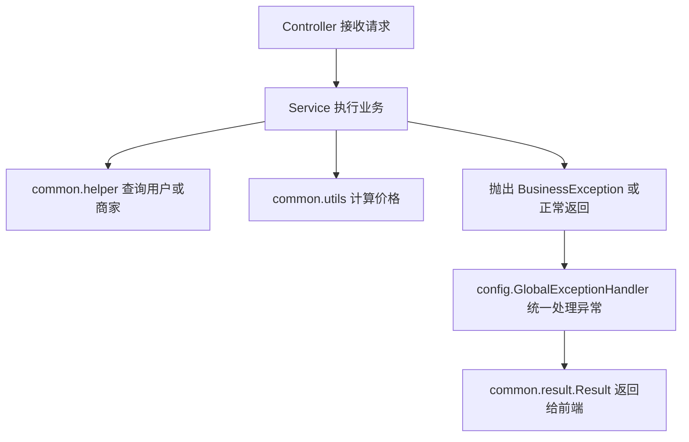
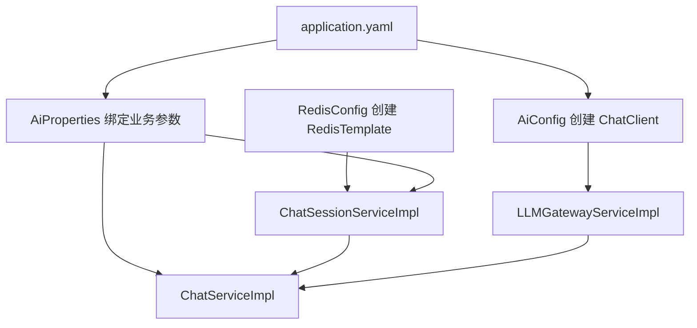

# common 与 config 包详细分析

## 1. 文档说明

本文档基于当前项目源码整理，目标是对以下两个基础包做系统分析：

- `org.example.ordermanagement.common`
- `org.example.ordermanagement.config`

分析重点包括：

- 包级定位：它们在整个项目分层中的位置
- 类级职责：每个类具体负责什么
- 依赖关系：它们被谁使用，又依赖了谁
- 运行作用：它们如何参与请求处理、异常处理、AI、Redis、分页等流程
- 设计评价：当前实现的优点与后续可优化点

这两个包虽然不直接承载“下单、评价、审核”等业务入口，但它们是整个项目能稳定运行的基础支撑层。

## 2. 源码范围

### 2.1 common 包

- `src/main/java/org/example/ordermanagement/common/exception/BusinessException.java`
- `src/main/java/org/example/ordermanagement/common/helper/UserHelper.java`
- `src/main/java/org/example/ordermanagement/common/helper/MerchantHelper.java`
- `src/main/java/org/example/ordermanagement/common/result/Result.java`
- `src/main/java/org/example/ordermanagement/common/utils/PriceUtil.java`

### 2.2 config 包

- `src/main/java/org/example/ordermanagement/config/AiConfig.java`
- `src/main/java/org/example/ordermanagement/config/AiProperties.java`
- `src/main/java/org/example/ordermanagement/config/GlobalExceptionHandler.java`
- `src/main/java/org/example/ordermanagement/config/MybatisPlusConfig.java`
- `src/main/java/org/example/ordermanagement/config/RedisConfig.java`

### 2.3 相关配置文件

- `src/main/resources/application.yaml`

### 2.4 主要关联业务实现

- `src/main/java/org/example/ordermanagement/service/impl/OrderServiceImpl.java`
- `src/main/java/org/example/ordermanagement/service/impl/ReviewServiceImpl.java`
- `src/main/java/org/example/ordermanagement/service/impl/MerchantStatisticsServiceImpl.java`
- `src/main/java/org/example/ordermanagement/service/impl/ChatServiceImpl.java`
- `src/main/java/org/example/ordermanagement/service/impl/ChatSessionServiceImpl.java`
- `src/main/java/org/example/ordermanagement/service/impl/LLMGatewayServiceImpl.java`
- `src/main/java/org/example/ordermanagement/service/impl/CaptchaServiceImpl.java`

## 3. 整体定位

从项目结构来看，这两个包都不是“面向页面功能”的业务包，而是基础设施层的一部分。

### 3.1 `common` 包定位

`common` 包负责沉淀“跨业务复用”的公共能力，特点是：

- 不直接面向某一个页面
- 会被多个 Service 或 Controller 共同使用
- 主要解决“重复逻辑抽取”和“统一约定”问题

在当前项目里，`common` 包主要承担以下职责：

- 统一业务异常表达
- 统一接口返回结构
- 抽取重复的用户 / 商家查询逻辑
- 抽取价格计算规则

可以把它理解为“项目公共基础工具层 + 轻量业务公共组件层”。

### 3.2 `config` 包定位

`config` 包负责集中定义 Spring 容器的运行规则和全局行为，特点是：

- 通过 `@Configuration`、`@Bean` 注册框架组件
- 通过 `@ConfigurationProperties` 绑定自定义配置
- 通过 `@RestControllerAdvice` 定义全局异常处理
- 不直接承载具体业务，但决定业务运行方式

在当前项目里，`config` 包主要承担以下职责：

- 创建 AI 调用所需的 `ChatClient`
- 绑定 AI 聊天相关业务配置
- 配置 RedisTemplate 序列化策略
- 配置 MyBatis-Plus 分页拦截器
- 定义全局异常到响应体的转换规则

可以把它理解为“系统运行时装配层”。

## 4. common 包详细分析

## 4.1 包内结构

| 子包 / 类 | 类型 | 核心作用 |
| --- | --- | --- |
| `exception/BusinessException` | 异常类 | 表达可直接返回给前端的业务异常 |
| `helper/UserHelper` | Spring 组件 | 封装按用户名查询用户的公共逻辑 |
| `helper/MerchantHelper` | Spring 组件 | 封装按用户名查询当前商家集合的公共逻辑 |
| `result/Result` | 返回模型 | 统一接口响应结构 |
| `utils/PriceUtil` | 工具类 | 统一菜品规格价格计算规则 |

## 4.2 `BusinessException`

源码：`common/exception/BusinessException.java`

### 4.2.1 职责

`BusinessException` 是项目中的统一业务异常类型，用于表达“这是可预期的业务失败，不是系统崩溃”。

例如：

- 用户不存在
- 商家不存在
- 订单不存在
- 菜品库存不足
- 当前订单状态不可取消

这类错误通常来自业务规则校验失败，消息内容可以直接展示给前端用户。

### 4.2.2 设计作用

它的价值在于把错误分成两类：

- 业务错误：由开发者主动抛出，可直接提示用户
- 系统错误：数据库故障、空指针、未知异常，不应暴露具体细节

在本项目中：

- Service 层大量使用 `throw new BusinessException(...)`
- `GlobalExceptionHandler` 统一捕获并转换为 `Result.fail(...)`

这样做的好处是：

- Controller 不需要到处写 `try/catch`
- 前端拿到的错误提示更稳定
- 业务规则表达更加清晰

### 4.2.3 使用场景

该异常在项目中被大量使用，典型模块包括：

- 用户模块
- 商家模块
- 订单模块
- 评价模块
- 浏览模块

说明它已经是整个项目的主业务异常机制。

## 4.3 `UserHelper`

源码：`common/helper/UserHelper.java`

### 4.3.1 职责

`UserHelper` 封装了“根据用户名查询用户，并在不存在时抛出业务异常”的重复逻辑。

对外主要提供两个方法：

- `getByUsername(String username)`
- `getIdByUsername(String username)`

### 4.3.2 为什么存在

在基于 JWT 的系统里，很多接口会先通过 `Authentication.getName()` 拿到用户名，然后再去数据库里查询当前用户。

如果每个 Service 都自己写：

```java
User user = userMapper.selectOne(...);
if (user == null) {
    throw new BusinessException("用户不存在");
}
```

就会出现大量重复代码。

`UserHelper` 的意义就是把这段高频重复逻辑统一抽走。

### 4.3.3 在项目中的作用

它被多个 Service 反复使用，包括但不限于：

- `AddressServiceImpl`
- `CartServiceImpl`
- `MerchantServiceImpl`
- `OrderServiceImpl`
- `ReviewServiceImpl`

它在这些业务里承担的是“身份落库映射入口”的角色：

- 从用户名拿到真实 `User`
- 从 `User` 再拿到 `userId`
- 后续业务基于 `userId` 做归属校验和数据查询

### 4.3.4 设计评价

优点：

- 消除重复代码
- 统一异常文案
- 提高 Service 可读性

需要注意的点：

- 它名字叫 `Helper`，但本质上已经是带数据库访问的领域组件
- 从职责上看，更接近“轻量查询服务”而不是普通工具类

## 4.4 `MerchantHelper`

源码：`common/helper/MerchantHelper.java`

### 4.4.1 职责

`MerchantHelper` 封装了“根据当前用户名找到其名下所有有效商家”的公共逻辑。

核心流程是：

1. 先通过 `UserHelper` 查询用户
2. 再通过 `merchantMapper` 按 `userId` 查询商家
3. 只保留 `status = 1` 的商家
4. 如果没有可用商家，抛出 `BusinessException`

### 4.4.2 为什么存在

商家端很多场景都需要先确认：

- 当前登录人是否拥有商家身份
- 当前商家是否审核通过
- 当前用户对应的是哪几个商家

这些规则如果散落在多个 Service 中，会导致：

- 校验方式不统一
- 错误信息不统一
- 后续维护成本高

### 4.4.3 在项目中的作用

它被多个商家侧 Service 使用，例如：

- `DishServiceImpl`
- `MerchantStatisticsServiceImpl`
- `OrderServiceImpl`
- `ReviewServiceImpl`

它承担的不是简单查询，而是“商家归属校验入口”：

- 商家看订单前，先拿到自己名下的 `merchantIds`
- 商家回复评价前，先确认评价是否属于自己
- 商家查看经营统计前，先确认当前账号有正常营业商家

### 4.4.4 设计评价

优点：

- 把商家归属校验逻辑集中管理
- 有利于多商家场景扩展
- 业务调用语义清晰

需要注意的点：

- 当前只按 `status = 1` 过滤，没有同时校验 `isOpen`
- 这意味着“审核通过但打烊”的商家仍可能被视为合法商家主体
- 从统计和管理角度看这通常合理，但从个别业务语义上需要明确

## 4.5 `Result<T>`

源码：`common/result/Result.java`

### 4.5.1 职责

`Result<T>` 是整个项目统一的接口响应包装对象，固定包含三个字段：

- `code`
- `message`
- `data`

典型成功响应：

```json
{
  "code": 200,
  "message": "success",
  "data": {}
}
```

### 4.5.2 在项目中的作用

当前项目的大部分 Controller 都返回 `Result<T>`，这意味着：

- 前端拿到的响应结构统一
- 成功和失败处理方式统一
- 全局异常处理器也可以直接返回同一结构

它提供了几个静态工厂方法：

- `success(T data)`
- `success()`
- `successMessage(String message)`
- `fail(String message)`

这样 Controller 编写会比较简洁。

### 4.5.3 设计价值

统一返回结构的好处包括：

- 前端不需要针对不同接口写不同解析逻辑
- 异常处理和正常返回风格一致
- 文档编写和联调更简单

### 4.5.4 需要注意的点

当前实现中：

- 成功返回 `code = 200`
- 失败返回 `code = 500`

这是“业务码”而不是严格的 HTTP 状态码语义。

这意味着：

- 很多失败场景的 HTTP 状态可能仍然是 200
- 前端要优先根据 `Result.code` 判断业务成败

对课程项目来说这没有问题，但如果走更标准的 REST 风格，后续可以考虑把 HTTP 状态码也表达出来。

## 4.6 `PriceUtil`

源码：`common/utils/PriceUtil.java`

### 4.6.1 职责

`PriceUtil` 封装了菜品规格价格的统一计算规则。

当前规则非常明确：

- 原价为空时返回 `0`
- 标签包含“大份”时，加 `5`
- 标签包含“小份”时，减 `5`
- 最终价格最低不低于 `0.01`

### 4.6.2 在项目中的作用

它主要被以下模块使用：

- `CartServiceImpl`
- `OrderServiceImpl`

这代表它同时参与了两个关键场景：

- 用户看购物车时的展示价格
- 用户下单时的实际成交价格

这点非常重要，因为如果两个地方各自写一套价格规则，就容易出现：

- 展示价格和下单价格不一致
- 购物车金额和订单金额不一致

### 4.6.3 设计评价

优点：

- 规则集中管理
- 避免价格逻辑散落
- 易于在购物车和订单之间保持一致

需要注意的点：

- 当前通过字符串 `contains(...)` 判断规格标签，规则比较简单
- 如果后续规格体系变复杂，比如“加料、辣度、套餐、阶梯加价”，这个类会逐渐变成真正的定价规则中心
- 到那时更适合把它从通用工具升级为专门的领域定价服务

## 4.7 common 包的整体作用

从全局来看，`common` 包做的是“统一约定 + 提高复用”。

它解决的核心问题是：

- 业务失败怎么表达
- 接口成功或失败怎么统一返回
- 用户和商家的重复查询逻辑怎么复用
- 菜品规格价格怎么统一计算

如果没有这个包，项目会出现以下问题：

- Service 中充满重复查询代码
- Controller 中到处都有不同风格的返回格式
- 不同模块的错误提示风格不一致
- 购物车和订单的价格规则容易分叉

## 5. config 包详细分析

## 5.1 包内结构

| 类 | 类型 | 核心作用 |
| --- | --- | --- |
| `AiConfig` | 配置类 | 注册 Spring AI 的 `ChatClient` Bean |
| `AiProperties` | 配置属性类 | 绑定 AI 聊天业务配置 |
| `GlobalExceptionHandler` | 全局异常处理器 | 统一把异常转换成 `Result` |
| `MybatisPlusConfig` | 配置类 | 注册分页拦截器 |
| `RedisConfig` | 配置类 | 自定义 `RedisTemplate<String, Object>` |

## 5.2 `AiConfig`

源码：`config/AiConfig.java`

### 5.2.1 职责

`AiConfig` 的作用是把 Spring AI 自动提供的 `ChatClient.Builder` 组装成一个可注入的 `ChatClient` Bean。

核心逻辑非常简单：

```java
@Bean
public ChatClient chatClient(ChatClient.Builder builder) {
    return builder.build();
}
```

### 5.2.2 在项目中的作用

这个 Bean 最终会被 `LLMGatewayServiceImpl` 注入，用于真正发起大模型调用。

调用链如下：

1. `application.yaml` 中配置 `spring.ai.openai.*`
2. Spring AI 自动配置底层连接能力
3. `AiConfig` 注册 `ChatClient`
4. `LLMGatewayServiceImpl` 注入 `ChatClient`
5. `ChatServiceImpl` 通过网关服务完成同步或流式问答

### 5.2.3 设计价值

这个类虽然很短，但作用很关键：

- 它把 AI 能力正式纳入 Spring 容器
- 后续如果要自定义默认模型、拦截器或调用选项，也可以从这里扩展

## 5.3 `AiProperties`

源码：`config/AiProperties.java`

### 5.3.1 职责

`AiProperties` 通过 `@ConfigurationProperties(prefix = "ai")` 绑定自定义业务配置。

当前绑定的是：

- `ai.chat.max-history-rounds`
- `ai.chat.session-ttl-seconds`
- `ai.chat.daily-limit`

注意：

- 它不负责绑定模型连接地址
- 它只负责 AI 聊天业务参数

模型连接参数来自：

- `spring.ai.openai.api-key`
- `spring.ai.openai.base-url`
- `spring.ai.openai.chat.options.*`

### 5.3.2 在项目中的作用

它主要被以下两个服务使用：

- `ChatServiceImpl`
- `ChatSessionServiceImpl`

具体作用包括：

- 限制每个用户每日可咨询次数
- 控制 Redis 会话最多保留多少轮对话
- 控制 Redis 聊天会话保留多久

### 5.3.3 设计价值

它把“AI 聊天业务规则”从代码中抽到了配置文件中，优点是：

- 调整限流参数不需要改代码
- 不同环境可以配置不同限制
- AI 模型接入配置和 AI 业务规则配置分离

这种分离是合理的，因为：

- `spring.ai.openai.*` 属于技术接入层配置
- `ai.chat.*` 属于业务策略配置

## 5.4 `GlobalExceptionHandler`

源码：`config/GlobalExceptionHandler.java`

### 5.4.1 职责

这是项目的全局异常处理器，使用 `@RestControllerAdvice` 对所有 Controller 生效。

它统一处理了以下几类异常：

- `BusinessException`
- `MethodArgumentNotValidException`
- `ConstraintViolationException`
- `RuntimeException`
- `Exception`

### 5.4.2 在项目中的作用

它是项目异常出口的统一收口点。

处理逻辑大致是：

- 业务异常：直接返回业务提示
- 参数异常：返回参数校验失败信息
- 未知异常：记录日志，前端统一看到“系统繁忙，请稍后重试”

### 5.4.3 为什么它重要

如果没有这个类：

- 每个 Controller 都得自己处理异常
- 返回结构可能不统一
- 系统异常容易把堆栈信息或内部细节暴露给前端

有了它之后：

- Controller 可以专注于参数接收和返回数据
- Service 可以放心抛业务异常
- 系统错误能被集中记录日志和统一降噪

### 5.4.4 设计评价

优点：

- 异常出口统一
- 与 `Result<T>` 形成完整闭环
- 能区分“可暴露错误”和“不可暴露错误”

需要注意的点：

- 当前所有失败都落成 `Result.fail(...)`
- 参数异常没有更细粒度区分字段级错误结构
- `ConstraintViolationException` 当前只返回固定文案，没有把更具体的约束消息透出

## 5.5 `MybatisPlusConfig`

源码：`config/MybatisPlusConfig.java`

### 5.5.1 职责

这个配置类注册了 MyBatis-Plus 的分页拦截器：

- `MybatisPlusInterceptor`
- `PaginationInnerInterceptor`

### 5.5.2 在项目中的作用

项目里大量使用了 `selectPage(...)` 分页查询，例如：

- 用户分页
- 商家分页
- 订单分页
- 优惠券分页
- 活动分页
- 评价分页

这些分页能力能够正常工作，依赖的就是这里的拦截器配置。

### 5.5.3 设计价值

它把分页能力变成了项目级公共能力，而不是每个 Mapper 单独处理。

如果没有它：

- 分页 SQL 可能不会按预期生效
- `Page<T>` 相关查询结果可能异常

因此它虽然代码很短，但属于典型的“基础设施必须配置项”。

## 5.6 `RedisConfig`

源码：`config/RedisConfig.java`

### 5.6.1 职责

`RedisConfig` 自定义了一个 `RedisTemplate<String, Object>`，并显式设置了序列化方式。

配置内容包括：

- key 使用 `StringRedisSerializer`
- hash key 使用 `StringRedisSerializer`
- value 使用 `GenericJackson2JsonRedisSerializer`
- hash value 使用 `GenericJackson2JsonRedisSerializer`

### 5.6.2 为什么需要它

如果不自定义序列化策略，默认的 RedisTemplate 往往会使用 JDK 序列化，可能导致：

- Redis 中 value 不可读
- key 或 value 存储结构不直观
- 不同服务之间不方便共享数据

当前配置后：

- Redis key 更清晰
- value 以 JSON 形式序列化，便于调试

### 5.6.3 在项目中的作用

这个 Bean 被多个服务使用，例如：

- `CaptchaServiceImpl`
- `ChatSessionServiceImpl`

典型用途包括：

- 存验证码
- 存聊天历史
- 记每日聊天次数

### 5.6.4 设计评价

优点：

- Redis 数据可读性更好
- 通用性强
- 满足当前验证码和聊天场景需求

需要注意的点：

- `ChatSessionServiceImpl` 当前实际是把消息对象先转成 JSON 字符串，再存进 Redis
- 由于 RedisTemplate 的 value 序列化器本身也是 JSON，这种做法相当于“JSON 字符串再走一次 JSON 序列化”
- 功能上可以运行，但序列化层次略多，后续可以考虑直接存对象或统一一种存储方式

## 5.7 config 包与配置文件的对应关系

当前 `application.yaml` 中与 `config` 包直接相关的配置主要有两类。

### 5.7.1 Redis 相关

```yaml
spring:
  data:
    redis:
      host: localhost
      port: 6379
      database: 0
```

这部分用于提供 Redis 连接工厂，再由 `RedisConfig` 基于连接工厂创建 `RedisTemplate`。

### 5.7.2 Spring AI 相关

```yaml
spring:
  ai:
    openai:
      api-key: ...
      base-url: https://api.deepseek.com
      chat:
        options:
          model: deepseek-chat
```

这部分用于给 Spring AI 提供模型调用连接参数，再由 `AiConfig` 暴露 `ChatClient`。

### 5.7.3 AI 业务参数

```yaml
ai:
  chat:
    max-history-rounds: 10
    session-ttl-seconds: 7200
    daily-limit: 100
```

这部分由 `AiProperties` 绑定，供聊天业务层使用。

## 6. 两个包之间的协作关系

从架构视角看，`common` 和 `config` 并不是彼此独立的，而是在一次请求中形成协作闭环。

典型闭环如下：



在 AI 聊天场景下，还会增加另一条链路：



这说明：

- `common` 更偏业务复用基础层
- `config` 更偏运行时装配和全局控制层
- 两者共同支撑 controller 和 service 的简洁实现

## 7. 这两个包对项目的总体价值

这两个包对项目的价值主要体现在以下几个方面：

### 7.1 统一性

- 统一异常类型
- 统一返回结构
- 统一分页能力
- 统一 Redis 使用方式
- 统一 AI 接入方式

### 7.2 可复用性

- 用户查询逻辑被多个业务复用
- 商家归属查询逻辑被多个商家端业务复用
- 价格规则被购物车和订单复用
- Redis 和 AI Bean 被多个服务复用

### 7.3 解耦性

- Controller 不关心异常细节
- Service 不关心异常响应格式
- 业务层不关心 ChatClient 怎么创建
- 使用 Redis 的代码不需要自己配序列化器

### 7.4 可维护性

- 修改错误处理策略时，只需要看全局异常处理器
- 修改 AI 限流参数时，只需要改配置文件
- 修改价格规则时，只需要改一个地方
- 修改用户 / 商家查询公共逻辑时，只需要改 helper

## 8. 当前实现的优点

- 基础公共能力已经开始集中沉淀，而不是散落在各个 Service 中
- `Result + BusinessException + GlobalExceptionHandler` 形成了比较完整的统一错误处理闭环
- `UserHelper` 和 `MerchantHelper` 有效减少了身份归属查询的重复代码
- `PriceUtil` 保证了购物车和订单价格规则一致
- `AiConfig + AiProperties` 把“模型接入”和“业务参数”做了合理分离
- `RedisConfig` 让 Redis 的使用方式更稳定、可读
- `MybatisPlusConfig` 把分页能力提升为全项目基础设施

## 9. 当前实现需要关注的点

### 9.1 `helper` 命名偏轻

`UserHelper` 和 `MerchantHelper` 其实已经不是普通辅助类，而是带数据库访问的 Spring 组件。

后续如果项目继续扩大，可以考虑按语义改成：

- `UserQueryService`
- `MerchantQueryService`

这样会更贴近真实职责。

### 9.2 `PriceUtil` 业务性较强

当前它放在 `common.utils` 没问题，但它承载的是明确的业务规则，而不是纯技术工具。

如果规格价格逻辑未来变复杂，建议将其下沉到订单或菜品定价领域中。

### 9.3 全局失败码较粗

`Result.fail(...)` 当前统一返回 `500`，会让：

- 参数错误
- 业务冲突
- 未知异常

在业务码层面都显得比较接近。

如果后续前后端联调需要更细粒度错误分类，可以增加更明确的业务码体系。

### 9.4 Redis 消息存储方式可继续优化

聊天消息当前是：

1. 先由 `ObjectMapper` 转成 JSON 字符串
2. 再通过 `RedisTemplate<String, Object>` 存储

这会带来一定的重复序列化感。

功能上没问题，但后续可以统一为：

- 直接存对象
- 或明确只存字符串

### 9.5 配置安全性需要注意

当前 `application.yaml` 中包含默认 AI Key 和 JWT Secret。

对练习项目来说方便启动，但如果进入真实协作或部署环境，建议：

- 全部改成环境变量注入
- 避免敏感信息写入仓库

## 10. 小结

`common` 和 `config` 虽然不直接体现业务页面功能，但它们是整个项目稳定性和可维护性的基础。

可以用一句话概括它们的分工：

- `common` 负责沉淀公共业务能力和统一约定
- `config` 负责装配框架能力和定义全局运行规则

如果把整个项目类比成一栋楼：

- `controller`、`service`、`mapper` 是一层层功能房间
- `common` 是公共管道、标准接口和通用工具
- `config` 是电路总闸、供水系统和设备安装说明

正因为有这两个包在底层托住，订单、评价、商家、客服这些上层功能才能保持相对整洁。
