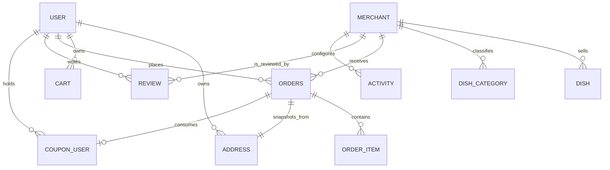

# 用户端接口详细设计

## 1. 文档说明

本文档基于当前项目源码整理，目标是从以下 3 个维度说明用户端实现：

- 接口设计：接口分组、请求路径、鉴权方式、入参和出参模型、关键业务规则
- 实体设计：用户端核心实体、关键字段、实体关系、状态字段含义
- Service 设计：各服务的职责边界、主要方法、事务处理、核心数据流

本文档覆盖的“用户端”不仅包括 `/api/user/**`，也包括用户实际会调用的认证、购物车、订单、评价、优惠券、活动、上传和智能客服接口。

## 2. 源码范围

### 2.1 Controller

- `src/main/java/org/example/ordermanagement/controller/common/AuthController.java`
- `src/main/java/org/example/ordermanagement/controller/common/UploadController.java`
- `src/main/java/org/example/ordermanagement/controller/common/ChatController.java`
- `src/main/java/org/example/ordermanagement/controller/user/UserController.java`
- `src/main/java/org/example/ordermanagement/controller/user/UserBrowseController.java`
- `src/main/java/org/example/ordermanagement/controller/user/AddressController.java`
- `src/main/java/org/example/ordermanagement/controller/user/CartController.java`
- `src/main/java/org/example/ordermanagement/controller/user/CouponController.java`
- `src/main/java/org/example/ordermanagement/controller/user/ActivityController.java`
- `src/main/java/org/example/ordermanagement/controller/user/OrderController.java`
- `src/main/java/org/example/ordermanagement/controller/user/ReviewController.java`

### 2.2 Service

- `src/main/java/org/example/ordermanagement/service/impl/UserServiceImpl.java`
- `src/main/java/org/example/ordermanagement/service/impl/UserBrowseServiceImpl.java`
- `src/main/java/org/example/ordermanagement/service/impl/AddressServiceImpl.java`
- `src/main/java/org/example/ordermanagement/service/impl/CartServiceImpl.java`
- `src/main/java/org/example/ordermanagement/service/impl/CouponServiceImpl.java`
- `src/main/java/org/example/ordermanagement/service/impl/ActivityServiceImpl.java`
- `src/main/java/org/example/ordermanagement/service/impl/OrderServiceImpl.java`
- `src/main/java/org/example/ordermanagement/service/impl/ReviewServiceImpl.java`
- `src/main/java/org/example/ordermanagement/service/impl/ChatServiceImpl.java`
- `src/main/java/org/example/ordermanagement/service/impl/ChatSessionServiceImpl.java`
- `src/main/java/org/example/ordermanagement/service/impl/CaptchaServiceImpl.java`

### 2.3 实体

- `src/main/java/org/example/ordermanagement/entity/User.java`
- `src/main/java/org/example/ordermanagement/entity/Address.java`
- `src/main/java/org/example/ordermanagement/entity/Merchant.java`
- `src/main/java/org/example/ordermanagement/entity/Dish.java`
- `src/main/java/org/example/ordermanagement/entity/DishCategory.java`
- `src/main/java/org/example/ordermanagement/entity/Cart.java`
- `src/main/java/org/example/ordermanagement/entity/Coupon.java`
- `src/main/java/org/example/ordermanagement/entity/CouponUser.java`
- `src/main/java/org/example/ordermanagement/entity/Activity.java`
- `src/main/java/org/example/ordermanagement/entity/Orders.java`
- `src/main/java/org/example/ordermanagement/entity/OrderItem.java`
- `src/main/java/org/example/ordermanagement/entity/Review.java`

## 3. 通用设计约定

### 3.1 统一响应结构

系统统一使用 `Result<T>` 作为响应包装：

```json
{
  "code": 200,
  "message": "success",
  "data": {}
}
```

字段说明：

- `code`：业务状态码，当前实现中 `200` 表示成功，`500` 表示失败
- `message`：提示信息
- `data`：返回数据

说明：

- Controller 不直接抛出给前端原始异常
- `BusinessException`、参数校验异常、运行时异常统一由全局异常处理器转换
- 当前实现更偏向“业务码驱动”，前端需要优先根据 `code/message` 处理

相关源码：

- `src/main/java/org/example/ordermanagement/common/result/Result.java`
- `src/main/java/org/example/ordermanagement/config/GlobalExceptionHandler.java`

### 3.2 鉴权设计

项目采用 Spring Security + JWT + 无状态会话。

用户端相关权限规则：

| 路径 | 鉴权规则 | 说明 |
| --- | --- | --- |
| `/api/auth/**` | `permitAll` | 注册、登录、找回密码、游客 token |
| `GET /api/user/merchant/**` | `permitAll` | 用户公开浏览商家和菜品 |
| `GET /api/review/**` | `permitAll` | 用户公开查看商家评价 |
| `/api/chat/**` | `permitAll` | Security 层放行，Controller 内二次判断是否登录 |
| `/api/upload/**` | 登录后可用 | `USER/ADMIN/MERCHANT` 均可 |
| `/api/user/**` | 登录后可用 | 当前用户资料类接口 |
| `/api/address/**` | 默认需认证 | 不在白名单内，走 `anyRequest().authenticated()` |
| `/api/cart/**` | 默认需认证 | 同上 |
| `/api/coupon/**` | 默认需认证 | 同上 |
| `/api/activity/**` | 默认需认证 | 当前配置下需要登录 |
| `/api/order/**` | 默认需认证 | 同上 |

说明：

- `/api/address`、`/api/cart`、`/api/coupon`、`/api/order` 虽然不是 `/api/user/**` 前缀，但仍是用户端接口
- `/api/chat/**` 在 Security 层放行，是为了避免游客请求直接 403；真正能否使用由 `ChatController` 判断

相关源码：

- `src/main/java/org/example/ordermanagement/security/SecurityConfig.java`

### 3.3 DTO / VO 分离

当前用户端实现遵循以下模式：

- DTO：接收前端入参，负责参数校验
- Entity：数据库映射对象，不直接对外暴露
- VO：对前端输出对象，按页面需要裁剪字段

优点：

- 能避免前端写入不该写的字段
- 能避免把内部字段直接暴露给客户端
- 有利于后续接口稳定迭代

## 4. 用户端接口模块设计

## 4.1 认证与账户初始化

Controller：`AuthController`

| 接口 | 方法 | 鉴权 | 入参 | 返回 | 说明 |
| --- | --- | --- | --- | --- | --- |
| `/api/auth/ping` | `GET` | 无需登录 | 无 | `Result<String>` | 服务健康检查 |
| `/api/auth/send-code` | `POST` | 无需登录 | `SendCodeDTO` | `Result<String>` | 注册前发送验证码 |
| `/api/auth/guest` | `POST` | 无需登录 | 无 | `Result<String>` | 签发游客 token |
| `/api/auth/register` | `POST` | 无需登录 | `RegisterDTO` | `Result<String>` | 注册用户 |
| `/api/auth/login` | `POST` | 无需登录 | `LoginDTO` | `Result<Map<String,Object>>` | 用户登录 |
| `/api/auth/reset-send-code` | `POST` | 无需登录 | `SendCodeDTO` | `Result<String>` | 找回密码验证码 |
| `/api/auth/reset-password` | `POST` | 无需登录 | `ResetPasswordDTO` | `Result<String>` | 重置密码 |

### 4.1.1 入参设计

- `RegisterDTO`
  - `username`
  - `password`
  - `phone`
  - `code`
  - `email`
- `LoginDTO`
  - `account`：支持用户名或手机号
  - `password`
- `ResetPasswordDTO`
  - `phone`
  - `code`
  - `newPassword`

### 4.1.2 核心业务规则

- 注册前先校验用户名唯一
- 注册前先校验手机号唯一
- 注册必须校验短信验证码
- 登录支持“用户名 / 手机号”双通道
- 用户状态不是 `1` 时禁止登录
- 重置密码只允许对已注册手机号发送验证码

### 4.1.3 Service 设计

对应服务：`UserServiceImpl`、`CaptchaServiceImpl`

关键方法：

- `register(RegisterDTO)`
- `login(LoginDTO)`
- `checkPhoneForRegister(String phone)`
- `sendResetPasswordCode(String phone)`
- `resetPassword(ResetPasswordDTO)`
- `sendCode(String phone)`
- `verifyCode(String phone, String code)`

说明：

- `UserServiceImpl` 负责账户主流程
- `CaptchaServiceImpl` 负责验证码生成和 Redis 存取
- 密码使用 `BCryptPasswordEncoder`
- 登录成功后使用 `JwtUtils.generateToken(...)` 签发 token

## 4.2 个人中心

Controller：`UserController`

| 接口 | 方法 | 鉴权 | 入参 | 返回 | 说明 |
| --- | --- | --- | --- | --- | --- |
| `/api/user/me` | `GET` | 登录 | 无 | `Result<UserInfoVO>` | 获取当前用户资料 |
| `/api/user/update` | `PUT` | 登录 | `UpdateUserDTO` | `Result<String>` | 修改昵称、邮箱、头像 |
| `/api/user/change-password` | `POST` | 登录 | `PasswordChangeDTO` | `Result<String>` | 修改密码 |
| `/api/user/send-code` | `POST` | 登录 | `SendCodeDTO` | `Result<String>` | 更换手机号前发送验证码 |
| `/api/user/update-phone` | `POST` | 登录 | `PhoneUpdateDTO` | `Result<String>` | 变更手机号 |

### 4.2.1 出参模型

- `UserInfoVO`
  - `id`
  - `username`
  - `nickname`
  - `phone`
  - `email`
  - `avatar`
  - `role`
  - `status`

### 4.2.2 核心业务规则

- 所有接口都以 `Authentication.getName()` 作为当前用户身份来源
- 用户修改资料时只允许改可编辑字段，不允许前端直接改 `role/status/password`
- 修改密码必须先校验原密码
- 修改手机号时必须校验原手机号和验证码
- 新手机号不能与其他用户重复

### 4.2.3 Service 设计

对应服务：`UserServiceImpl`

关键方法：

- `getCurrentUserInfo(String username)`
- `updateUserInfo(String username, UpdateUserDTO dto)`
- `changePassword(String username, PasswordChangeDTO dto)`
- `sendPhoneCode(String phone)`
- `updatePhone(String username, PhoneUpdateDTO dto)`

事务方法：

- `updatePhone(...)`
- `resetPassword(...)`

## 4.3 商家浏览

Controller：`UserBrowseController`

| 接口 | 方法 | 鉴权 | 入参 | 返回 | 说明 |
| --- | --- | --- | --- | --- | --- |
| `/api/user/merchant/page` | `GET` | 公开 | `UserMerchantQueryDTO` | `Result<IPage<UserMerchantVO>>` | 分页查看商家 |
| `/api/user/merchant/{id}` | `GET` | 公开 | 路径变量 | `Result<UserMerchantDetailVO>` | 查看商家详情 |
| `/api/user/merchant/{id}/dish/list` | `GET` | 公开 | 路径变量 | `Result<List<UserDishListVO>>` | 查看商家菜品列表 |

### 4.3.1 出参模型

- `UserMerchantVO`
  - 商家列表页使用
  - 隐藏了 `userId`、`businessLicense`、`status` 等后台字段
- `UserMerchantDetailVO`
  - 商家详情页使用
- `UserDishListVO`
  - 菜品列表页使用
  - 带 `categoryName`、`price`、`originalPrice`、`sales`、`stock`

### 4.3.2 核心业务规则

- 只展示审核通过的商家，即 `merchant.status = 1`
- 商家分页按“是否营业 -> 评分 -> 创建时间”排序
- 商家详情仅校验是否审核通过
- 商家菜品列表在当前实现中还会校验 `isOpen = 1`
- 菜品列表只返回 `dish.status = 1` 的上架菜品

### 4.3.3 Service 设计

对应服务：`UserBrowseServiceImpl`

关键方法：

- `pageMerchants(UserMerchantQueryDTO queryDTO)`
- `getMerchantDetail(Long merchantId)`
- `listMerchantDishes(Long merchantId)`

实现特点：

- 查询页先查 `Merchant`，再映射成 `UserMerchantVO`
- 菜品列表会同时查 `DishCategory`，补出 `categoryName`

## 4.4 地址管理

Controller：`AddressController`

| 接口 | 方法 | 鉴权 | 入参 | 返回 | 说明 |
| --- | --- | --- | --- | --- | --- |
| `/api/address/save` | `POST` | 登录 | `AddressSaveDTO` | `Result<String>` | 新增或修改地址 |
| `/api/address/my` | `GET` | 登录 | `UserAddressQueryDTO` | `Result<IPage<AddressVO>>` | 分页查看我的地址 |
| `/api/address/{id}` | `DELETE` | 登录 | 路径变量 | `Result<String>` | 删除地址 |

### 4.4.1 设计特点

- `save` 一个接口同时负责新增和更新
- `dto.id == null` 表示新增，否则表示更新
- `isDefault = 1` 时会先清掉当前用户原有默认地址

### 4.4.2 出参模型

- `AddressVO`
  - `id`
  - `contactName`
  - `contactPhone`
  - `province`
  - `city`
  - `district`
  - `detailAddress`
  - `isDefault`

### 4.4.3 Service 设计

对应服务：`AddressServiceImpl`

关键方法：

- `saveAddress(String username, AddressSaveDTO dto)`
- `pageMyAddresses(String username, UserAddressQueryDTO dto)`
- `deleteAddress(String username, Long id)`

核心规则：

- 所有地址写操作都校验地址归属
- 分页返回时按“默认地址优先 + 最新创建优先”排序

## 4.5 购物车

Controller：`CartController`

| 接口 | 方法 | 鉴权 | 入参 | 返回 | 说明 |
| --- | --- | --- | --- | --- | --- |
| `/api/cart/add` | `POST` | 登录 | `CartAddDTO` | `Result<String>` | 加入购物车 |
| `/api/cart/list` | `GET` | 登录 | 无 | `Result<List<CartVO>>` | 获取购物车列表 |
| `/api/cart/update` | `POST` | 登录 | `CartUpdateDTO` | `Result<String>` | 更新购物车数量 |
| `/api/cart/{id}` | `DELETE` | 登录 | 路径变量 | `Result<String>` | 删除购物车项 |
| `/api/cart/clear` | `DELETE` | 登录 | 无 | `Result<String>` | 清空购物车 |

### 4.5.1 入参设计

- `CartAddDTO`
  - `dishId`
  - `quantity`
  - `dishTags`
- `CartUpdateDTO`
  - `id`
  - `quantity`

### 4.5.2 出参模型

- `CartVO`
  - `id`
  - `dishId`
  - `merchantId`
  - `dishName`
  - `dishImage`
  - `price`
  - `quantity`
  - `stock`
  - `shopName`
  - `dishTags`

### 4.5.3 核心业务规则

- 加购时会校验菜品存在、已上架、库存充足
- 加购时会校验商家存在且审核通过
- 支持购物车中同时存在多个商家的商品
- 对同一用户、同一菜品、同一规格标签的购物车项进行合并
- 列表展示时动态联查菜品和商家，价格通过 `PriceUtil.calculateFinalPrice(...)` 计算

### 4.5.4 Service 设计

对应服务：`CartServiceImpl`

关键方法：

- `addToCart(...)`
- `listCart(...)`
- `updateCartQuantity(...)`
- `deleteCartItem(...)`
- `clearCart(...)`

## 4.6 优惠券

Controller：`CouponController`

| 接口 | 方法 | 鉴权 | 入参 | 返回 | 说明 |
| --- | --- | --- | --- | --- | --- |
| `/api/coupon/available` | `GET` | 登录 | `UserCouponQueryDTO` | `Result<IPage<CouponVO>>` | 查看当前可领取优惠券 |
| `/api/coupon/receive/{id}` | `POST` | 登录 | 路径变量 | `Result<Void>` | 领取优惠券 |
| `/api/coupon/my` | `GET` | 登录 | `UserCouponQueryDTO` | `Result<IPage<CouponVO>>` | 查看我的优惠券 |

### 4.6.1 出参模型

- `CouponVO`
  - `id`
  - `name`
  - `type`
  - `value`
  - `minAmount`
  - `startTime`
  - `endTime`
  - `remainCount`
  - `eachLimit`
  - `status`
  - `received`
  - `ownedCount`

### 4.6.2 核心业务规则

- 仅返回 `status=ACTIVE` 且处于生效时间窗口内的券
- 可领券列表会额外计算“当前用户是否已领取”和“已领数量”
- 领取时校验：
  - 券存在
  - 券状态可用
  - 当前时间在可领取区间内
  - 剩余数量足够
  - 未超过每人限领数
- 领取成功后会插入 `coupon_user` 记录，并扣减 `remain_count`

### 4.6.3 Service 设计

对应服务：`CouponServiceImpl`

关键方法：

- `pageAvailableCoupons(Long userId, UserCouponQueryDTO dto)`
- `receiveCoupon(Long userId, Long couponId)`
- `pageMyCoupons(Long userId, UserCouponQueryDTO dto)`

说明：

- `Coupon` 是券模板
- `CouponUser` 是用户实际持有的券实例

## 4.7 活动

Controller：`ActivityController`

| 接口 | 方法 | 鉴权 | 入参 | 返回 | 说明 |
| --- | --- | --- | --- | --- | --- |
| `/api/activity/active` | `GET` | 当前配置下需登录 | `merchantId` 可选 | `Result<List<ActivityVO>>` | 查询当前有效活动 |
| `/api/activity/calculate` | `GET` | 当前配置下需登录 | `amount`、`merchantId` 可选 | `Result<BigDecimal>` | 计算可命中的最大活动优惠 |

### 4.7.1 活动规则设计

- `Activity.rules` 使用 JSON 存储阶梯规则
- 典型格式：

```json
[
  { "threshold": 30, "reduce": 5 },
  { "threshold": 50, "reduce": 10 }
]
```

### 4.7.2 Service 设计

对应服务：`ActivityServiceImpl`

关键方法：

- `getActiveActivities(Long merchantId)`
- `calculateDiscount(BigDecimal orderAmount, Long merchantId)`

规则：

- 查询当前时间有效的活动
- 支持平台活动和商家活动
- 对命中的活动规则取最大优惠值

## 4.8 订单

Controller：`OrderController`

| 接口 | 方法 | 鉴权 | 入参 | 返回 | 说明 |
| --- | --- | --- | --- | --- | --- |
| `/api/order/create` | `POST` | 登录 | `OrderCreateDTO` | `Result<String>` | 创建订单 |
| `/api/order/my` | `GET` | 登录 | `UserOrderQueryDTO` | `Result<IPage<OrderVO>>` | 分页查看我的订单 |
| `/api/order/{id}` | `GET` | 登录 | 路径变量 | `Result<OrderDetailVO>` | 查看订单详情 |
| `/api/order/{id}/cancel` | `POST` | 登录 | 路径变量 | `Result<String>` | 取消订单 |
| `/api/order/{id}/pay` | `POST` | 登录 | 路径变量 | `Result<String>` | 模拟支付 |
| `/api/order/{id}/confirm` | `POST` | 登录 | 路径变量 | `Result<String>` | 确认收货 |
| `/api/order/{id}/refund` | `POST` | 登录 | 路径变量 + `RefundApplyDTO` | `Result<String>` | 申请退款 |

### 4.8.1 入参模型

- `OrderCreateDTO`
  - `addressId`
  - `merchantId`
  - `remark`
  - `couponId`
- `UserOrderQueryDTO`
  - `status`
  - `current`
  - `size`
- `RefundApplyDTO`
  - `reason`

### 4.8.2 出参模型

- `OrderVO`
  - 用于订单列表
  - 含订单头信息、优惠信息、联系人、配送地址
- `OrderDetailVO`
  - 用于订单详情
  - 在 `OrderVO` 基础上补充退款信息、收货时间和明细列表
- `OrderItemVO`
  - 订单明细项

### 4.8.3 创建订单核心流程

`OrderServiceImpl.createOrder(...)` 是用户端最核心的业务编排，主要步骤如下：

1. 根据当前用户读取指定商家的购物车
2. 校验购物车不能为空
3. 校验商家存在、审核通过、营业中
4. 校验地址存在且属于当前用户
5. 逐项校验菜品存在、上架、库存足够
6. 计算订单原价
7. 计算活动优惠
8. 计算优惠券优惠
9. 二者择优，生成最终优惠金额
10. 创建订单头 `Orders`
11. 把收货地址写成订单快照
12. 创建订单明细 `OrderItem`
13. 扣减菜品库存并增加销量
14. 清空当前商家的购物车
15. 如使用优惠券，则将 `CouponUser` 标记为 `USED`

### 4.8.4 订单相关业务规则

- 订单列表和详情都只允许查看自己的订单
- 取消订单仅允许 `PENDING_PAYMENT`
- 支付订单仅允许 `PENDING_PAYMENT`
- 确认收货仅允许 `ACCEPTED`
- 退款申请仅允许 `ACCEPTED` 或 `RECEIVED`
- 取消订单时会恢复库存、销量、优惠券状态

### 4.8.5 Service 设计

对应服务：`OrderServiceImpl`

关键方法：

- `createOrder(...)`
- `pageMyOrders(...)`
- `getOrderDetail(...)`
- `cancelOrder(...)`
- `payOrder(...)`
- `confirmReceived(...)`
- `applyRefund(...)`

事务方法：

- `createOrder(...)`
- `cancelOrder(...)`
- `payOrder(...)`
- `confirmReceived(...)`
- `applyRefund(...)`

## 4.9 评价

Controller：`ReviewController`

| 接口 | 方法 | 鉴权 | 入参 | 返回 | 说明 |
| --- | --- | --- | --- | --- | --- |
| `/api/review/save` | `POST` | 登录 | `ReviewSaveDTO` | `Result<String>` | 提交评价 |
| `/api/review/my` | `GET` | 登录 | `UserReviewQueryDTO` | `Result<IPage<ReviewVO>>` | 我的评价分页 |
| `/api/review/merchant/{merchantId}` | `GET` | 公开 | 路径变量 | `Result<List<ReviewVO>>` | 查看商家公开评价 |
| `/api/review/follow-up/{reviewId}` | `POST` | 登录 | `Map<String,String>` | `Result<String>` | 用户追评 |

### 4.9.1 入参设计

- `ReviewSaveDTO`
  - `orderId`
  - `rating`
  - `content`
- `UserReviewQueryDTO`
  - `shopName`
  - `current`
  - `size`

### 4.9.2 出参模型

- `ReviewVO`
  - `id`
  - `orderId`
  - `merchantId`
  - `shopName`
  - `nickname`
  - `avatar`
  - `rating`
  - `content`
  - `merchantReply`
  - `merchantReplyTime`
  - `followUpContent`
  - `followUpTime`
  - `status`
  - `createTime`

### 4.9.3 核心业务规则

- 只能评价自己的订单
- 只有 `COMPLETED` 状态订单可评价
- 一个订单只能评价一次
- 商家评价列表只展示 `status = 1` 的正常评价
- 用户追评只能对自己的评价操作，且只能追评一次
- 每次新增评价后都会重新计算商家平均评分

### 4.9.4 Service 设计

对应服务：`ReviewServiceImpl`

关键方法：

- `saveReview(...)`
- `pageMyReviews(...)`
- `listMerchantReviews(...)`
- `userFollowUp(...)`
- `updateMerchantRating(...)`

## 4.10 上传

Controller：`UploadController`

| 接口 | 方法 | 鉴权 | 入参 | 返回 | 说明 |
| --- | --- | --- | --- | --- | --- |
| `/api/upload/avatar` | `POST` | 登录 | `MultipartFile` | `Result<String>` | 上传头像 |
| `/api/upload/image` | `POST` | 登录 | `MultipartFile` | `Result<String>` | 上传图片 |

### 4.10.1 规则

- 仅允许 `image/*` 类型
- 单文件大小限制 5MB
- 文件名使用 UUID 重命名
- 返回值为静态资源访问路径，如 `/static/avatars/xxx.jpg`

## 4.11 智能客服

Controller：`ChatController`

| 接口 | 方法 | 鉴权 | 入参 | 返回 | 说明 |
| --- | --- | --- | --- | --- | --- |
| `/api/chat/send` | `POST` | Controller 内要求登录 | `ChatMessageDTO` | `Result<ChatResponseVO>` | 同步问答 |
| `/api/chat/stream` | `POST` | Controller 内要求登录 | `ChatMessageDTO` | `Flux<ServerSentEvent<String>>` | SSE 流式问答 |
| `/api/chat/history` | `GET` | Controller 内要求登录 | 无 | `Result<List<ChatMessageVO>>` | 当前会话历史 |
| `/api/chat/session` | `DELETE` | Controller 内要求登录 | 无 | `Result<String>` | 清空会话 |

### 4.11.1 入参设计

- `ChatMessageDTO`
  - `content`
  - `orderId`
  - `merchantId`

说明：

- 当前实现中，角色不再由前端传递
- 用户真实角色通过 `Authentication` 在服务端解析

### 4.11.2 出参设计

- `ChatMessageVO`
  - `role`
  - `content`
  - `createdAt`
- `ChatResponseVO`
  - `content`
  - `messageCount`
  - `history`

### 4.11.3 核心业务规则

- 游客或未登录用户不能真正调用客服
- 每个用户有每日消息上限
- 会话历史存 Redis，最多保留最近若干轮
- 当用户在订单详情页打开客服时，可注入当前订单上下文
- 用户端客服 prompt 会注入：
  - 最近订单
  - 可用优惠券
  - 当前订单详情

### 4.11.4 Service 设计

对应服务：

- `ChatServiceImpl`
- `ChatSessionServiceImpl`
- `BusinessContextServiceImpl`
- `LLMGatewayServiceImpl`

关键方法：

- `sendMessage(...)`
- `sendMessageStream(...)`
- `getHistory(...)`
- `clearSession(...)`
- `appendMessage(...)`
- `checkAndIncrementDailyCount(...)`

## 5. 实体类设计

## 5.1 核心实体关系



## 5.2 实体说明

| 实体 | 关键字段 | 说明 |
| --- | --- | --- |
| `User` | `username/password/phone/role/status` | 用户主表，`status=1` 表示正常 |
| `Address` | `userId/contactName/contactPhone/detailAddress/isDefault` | 用户收货地址 |
| `Merchant` | `userId/shopName/status/isOpen/rating` | 商家信息，`status` 表审核，`isOpen` 表营业状态 |
| `Dish` | `merchantId/categoryId/name/price/originalPrice/status/stock/sales` | 菜品实体 |
| `DishCategory` | `merchantId/name/sortOrder` | 菜品分类 |
| `Cart` | `userId/merchantId/dishId/quantity/dishTags` | 购物车项 |
| `Coupon` | `type/value/minAmount/startTime/endTime/remainCount/eachLimit/status` | 优惠券模板 |
| `CouponUser` | `userId/couponId/status/receiveTime/useTime/orderId` | 用户持券记录 |
| `Activity` | `rules/startTime/endTime/merchantId/status` | 营销活动，规则为 JSON |
| `Orders` | `orderNo/userId/merchantId/totalAmount/status/address快照/退款字段` | 订单主表 |
| `OrderItem` | `orderId/dishId/dishName/price/quantity/amount/dishTags` | 订单明细表 |
| `Review` | `orderId/userId/merchantId/rating/content/reply/followUp/status` | 用户评价表 |

## 5.3 状态字段设计

### 5.3.1 用户

- `User.role`
  - `USER`
  - `MERCHANT`
  - `ADMIN`
- `User.status`
  - `1`：正常
  - `0` 或 `null`：禁用 / 非正常

### 5.3.2 商家

- `Merchant.status`
  - `0`：待审核
  - `1`：审核通过
  - `2`：下线 / 停用
  - `3`：审核拒绝
- `Merchant.isOpen`
  - `1`：营业中
  - `0`：打烊

### 5.3.3 优惠券

- `Coupon.type`
  - `DISCOUNT`
  - `REDUCE`
  - `CASH`
- `Coupon.status`
  - `ACTIVE`
  - `INACTIVE`
- `CouponUser.status`
  - `UNUSED`
  - `USED`
  - `EXPIRED`

### 5.3.4 订单

- `PENDING_PAYMENT`
- `PAID`
- `ACCEPTED`
- `COMPLETED`
- `CANCELLED`
- `RECEIVED`
- `REFUND_PENDING`
- `REFUNDED`

### 5.3.5 评价

- `Review.status`
  - `1`：正常
  - `0`：屏蔽

## 6. Service 层职责划分

| Service | 职责 | 主要依赖 | 是否承担事务编排 |
| --- | --- | --- | --- |
| `UserServiceImpl` | 注册、登录、资料维护、改密、换绑手机号、重置密码 | `UserMapper`、`PasswordEncoder`、`JwtUtils`、`CaptchaService` | 是 |
| `UserBrowseServiceImpl` | 商家分页、详情、菜品浏览 | `MerchantMapper`、`DishMapper`、`DishCategoryMapper` | 否 |
| `AddressServiceImpl` | 地址增删改查 | `AddressMapper`、`UserHelper` | 否 |
| `CartServiceImpl` | 购物车增删改查、动态价格展示 | `CartMapper`、`DishMapper`、`MerchantMapper`、`UserHelper` | 否 |
| `CouponServiceImpl` | 券列表、领券、我的优惠券 | `CouponMapper`、`CouponUserMapper` | 是 |
| `ActivityServiceImpl` | 活动查询、活动优惠计算 | `ActivityMapper`、`MerchantMapper` | 否 |
| `OrderServiceImpl` | 下单、订单详情、支付、取消、确认收货、退款 | 多个 Mapper + `ActivityService` + `CouponService` + Helper | 是 |
| `ReviewServiceImpl` | 评价、追评、商家评分聚合 | `ReviewMapper`、`OrdersMapper`、`MerchantMapper`、`UserMapper` | 是 |
| `ChatServiceImpl` | 智能客服编排、上下文注入 | `ChatSessionService`、`BusinessContextService`、`LLMGatewayService`、`OrderService` | 否 |
| `ChatSessionServiceImpl` | 聊天历史与限流存储 | `RedisTemplate`、`AiProperties` | 否 |
| `CaptchaServiceImpl` | 验证码生成与校验 | `RedisTemplate` | 否 |

## 7. 典型用户业务流

## 7.1 注册登录流

1. 用户调用 `/api/auth/send-code`
2. 后端校验手机号未注册
3. Redis 写入验证码
4. 用户提交 `/api/auth/register`
5. 后端校验用户名、手机号、验证码
6. 创建 `User`
7. 用户调用 `/api/auth/login`
8. 后端校验账号和密码
9. 返回 JWT token

## 7.2 浏览下单流

1. 用户查看商家分页 `/api/user/merchant/page`
2. 查看商家详情 `/api/user/merchant/{id}`
3. 查看菜品列表 `/api/user/merchant/{id}/dish/list`
4. 加入购物车 `/api/cart/add`
5. 维护地址 `/api/address/save`
6. 领取优惠券 `/api/coupon/receive/{id}`
7. 创建订单 `/api/order/create`
8. 支付订单 `/api/order/{id}/pay`
9. 查看订单列表和详情

## 7.3 售后流

1. 订单进入商家接单状态后，用户可确认收货
2. 用户可在允许的状态下申请退款
3. 商家同意退款时恢复库存、销量、优惠券

## 7.4 评价流

1. 已完成订单发起评价 `/api/review/save`
2. 后端写入 `Review`
3. 重新计算商家平均评分
4. 用户后续可追评一次

## 7.5 智能客服流

1. 用户发送消息 `/api/chat/send` 或 `/api/chat/stream`
2. 服务端从 Security 上下文解析角色
3. 读取 Redis 历史会话
4. 构建用户上下文：
   - 最近订单
   - 可用优惠券
   - 当前订单详情
5. 调用 LLM 网关
6. 写回 Redis 历史会话

## 8. 当前实现的优点

- Controller 职责清晰，接口边界明确
- DTO / Entity / VO 分层完整
- 用户标识统一从 `Authentication` 获取，避免越权写入
- 订单领域设计较完整，包含地址快照和优惠快照
- 评价后自动回写商家评分，形成闭环
- 智能客服接入了真实业务上下文，不是纯聊天机器人
- Redis 同时承担验证码、客服会话和消息限额功能，职责清晰

## 9. 当前实现需要关注的点

- `/api/activity/**` 当前在安全配置中未显式放行为公开接口，如前端希望未登录也能查看活动，需要补充安全规则
- 订单状态 `ACCEPTED / RECEIVED / COMPLETED` 的业务语义建议继续统一，避免前后端理解不一致
- 验证码校验当前是“读到后立即删除”，输错一次也会失效，若产品希望支持重试，需要调整策略
- 领券逻辑当前是普通读写更新，若后续并发量变大，需要进一步考虑库存并发控制

## 10. 小结

从用户端设计来看，这个项目已经具备比较完整的业务闭环：

- 有账户体系
- 有商家和菜品浏览
- 有地址和购物车
- 有活动和优惠券
- 有订单主流程与售后
- 有评价体系
- 有上传和智能客服能力

整体实现风格偏“课程项目中的中高完成度版本”，但在订单、营销和客服三块已经具备明显的真实业务建模意识，适合继续往接口文档、毕业设计说明书、系统设计文档或后续优化任务拆解。
