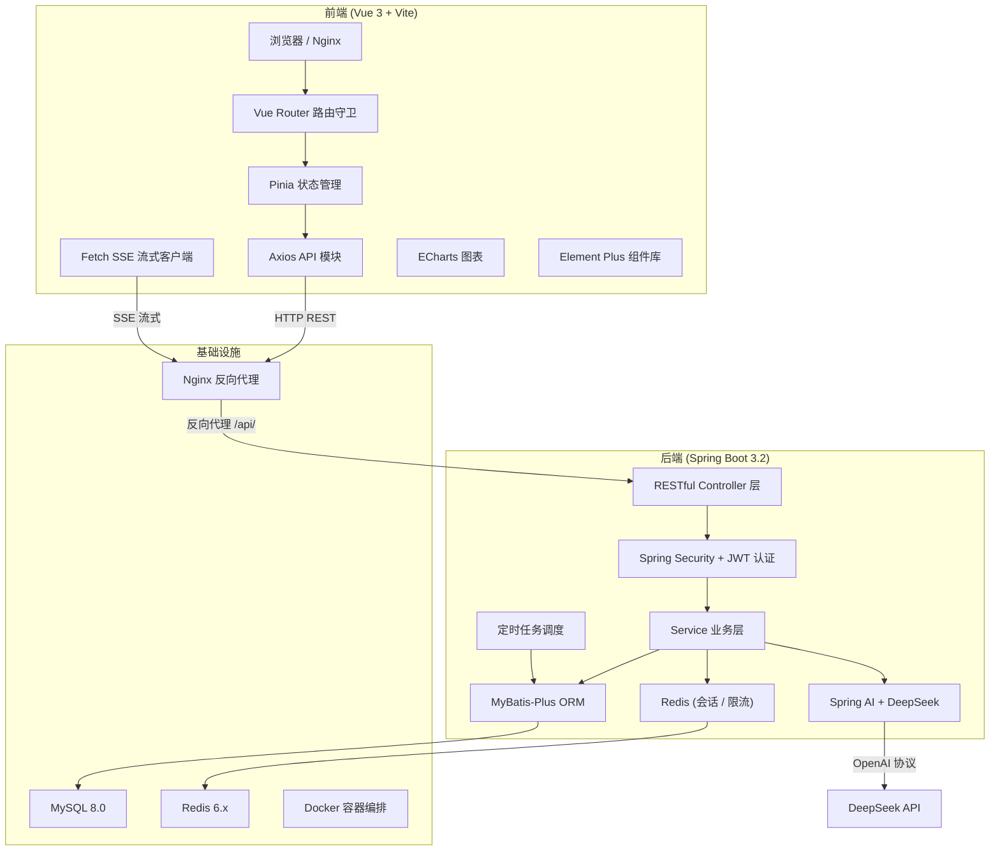
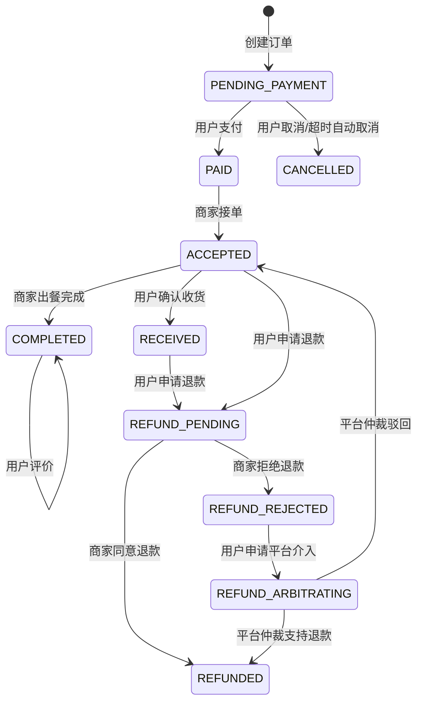
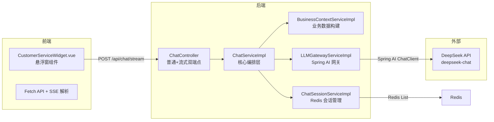

# 🎓 外卖订单管理系统 — 项目答辩报告

> **设计与实现 · 前后端分离全栈项目**
> 答辩时间：2026 年 3 月 28 日

---

## 一、项目概述

本系统是一套**前后端完全分离的外卖订单管理平台**，面向三类角色（用户、商家、管理员）提供完整的点餐、订单、评价、优惠券、营销活动以及 **AI 智能客服**等功能。项目采用 **Spring Boot 3.2 + Vue 3** 技术栈，集成了 **Spring AI（DeepSeek 大模型）**、**Redis 会话缓存**、**Spring Security + JWT 认证授权**等企业级技术方案，并支持 **Docker 多阶段构建**一键部署。

### 1.1 核心功能清单

| 角色 | 核心功能模块 |
|------|-------------|
| **用户端** | 商家浏览、菜品选购、购物车、订单管理、退款/仲裁、评价（含追评）、地址管理、优惠券/活动中心、AI 智能客服 |
| **商家端** | 店铺管理、菜品分类、菜品 CRUD、订单接单/出餐/退款审核、评价回复、经营数据统计 |
| **管理员端** | 数据大盘、用户管理（禁用/解禁）、商家审核、订单监管、仲裁裁决、优惠券管理、活动管理、评价审核 |

---

## 二、系统架构

### 2.1 整体架构图



### 2.2 项目目录结构

````carousel
```
📦 OrderManagement (后端 - Spring Boot)
├── src/main/java/org/example/ordermanagement/
│   ├── config/              # 配置类 (AI/Redis/MBP/全局异常)
│   ├── security/            # 安全模块 (JWT/过滤器/权限)
│   ├── controller/
│   │   ├── admin/           # 管理员 API (7个控制器)
│   │   ├── merchant/        # 商家 API (6个控制器)
│   │   ├── user/            # 用户 API (8个控制器)
│   │   └── common/          # 公共 API (认证/聊天/上传)
│   ├── service/impl/        # 业务实现 (17个Service)
│   ├── entity/              # 实体类 (12个表映射)
│   ├── mapper/              # MyBatis-Plus Mapper
│   ├── dto/                 # 数据传输对象 (请求)
│   ├── vo/                  # 视图对象 (响应)
│   ├── common/              # 公共组件 (异常/工具/Helper)
│   └── task/                # 定时任务
├── Dockerfile               # 多阶段构建
└── pom.xml                  # Maven 依赖管理
```
<!-- slide -->
```
📦 Order-Project (前端 - Vue 3)
├── src/
│   ├── api/                 # API 接口模块 (19个文件)
│   ├── views/
│   │   ├── admin/           # 管理员页面 (8个组件)
│   │   ├── merchant/        # 商家页面 (7个组件)
│   │   ├── user/            # 用户页面 (13+组件)
│   │   ├── login/           # 登录/注册/忘记密码
│   │   └── home/            # 首页
│   ├── components/          # 全局组件 (AI客服悬浮窗)
│   ├── stores/              # Pinia 状态管理
│   ├── router/              # 路由 (含权限守卫)
│   ├── layout/              # 布局框架
│   └── utils/               # 工具函数
├── nginx.conf               # Nginx 生产配置
├── Dockerfile               # 多阶段构建
└── package.json             # 依赖管理
```
````

---

## 三、技术栈详解

### 3.1 后端技术栈

| 技术 | 版本/说明 | 用途 |
|------|----------|------|
| **Spring Boot** | 3.2.5 | 核心框架，自动配置、嵌入式容器 |
| **Spring Security** | 6.x | 认证鉴权（无状态 JWT + 多角色 RBAC） |
| **Spring AI** | 1.0.0-M6 | 标准化大模型调用框架（对接 DeepSeek） |
| **Spring WebFlux** | Reactor Flux | SSE 流式响应（AI 打字机效果） |
| **MyBatis-Plus** | 3.5.5 | ORM 增强框架（LambdaWrapper / 分页） |
| **Redis** | 6.x | AI 会话存储、每日限流计数器 |
| **JJWT** | 0.11.5 | JWT Token 生成与验证 |
| **Lombok** | - | 消除样板代码 |
| **MySQL** | 8.0 | 主数据库 |
| **Docker** | 多阶段构建 | 容器化部署 |

> **源码参考**: [pom.xml](file:///d:/项目实战/OrderManagement/pom.xml) · [application.yaml](file:///d:/项目实战/OrderManagement/src/main/resources/application.yaml)

### 3.2 前端技术栈

| 技术 | 版本 | 用途 |
|------|------|------|
| **Vue 3** | 3.5.24 | 核心前端框架（Composition API） |
| **Vite** | 7.2.2 | 极速开发构建工具 |
| **Vue Router** | 5.0.3 | SPA 路由管理（含权限守卫） |
| **Pinia** | 3.0.4 | 状态管理（用户态、商家态） |
| **Element Plus** | 2.13.5 | UI 组件库 |
| **Axios** | 1.13.6 | HTTP 请求封装（拦截器） |
| **ECharts** | 6.0.0 | 数据可视化图表 |
| **marked** | 17.0.5 | Markdown 渲染（AI 回复） |
| **Sass** | - | CSS 预处理器 |

> **源码参考**: [package.json](file:///d:/项目实战/Order-Project/package.json)

---

## 四、核心功能模块分析

### 4.1 认证授权模块

#### 4.1.1 多角色体系

系统支持四种角色：**USER（普通用户）**、**MERCHANT（商家）**、**ADMIN（管理员）**、**GUEST（游客）**。

**后端实现要点**：

- 前端无 Token 时，路由守卫**静默申请游客 Token**，实现商家大厅无感浏览
- 游客 Token 有效期 2 小时，不关联数据库用户
- 真实用户登录后，JWT 中写入 `role` 声明，通过 `JwtAuthenticationFilter` 注入 Security 上下文

**关键源码**：

| 文件 | 说明 |
|------|------|
| [AuthController.java](file:///d:/项目实战/OrderManagement/src/main/java/org/example/ordermanagement/controller/common/AuthController.java) | 登录/注册/游客Token签发 |
| [JwtUtils.java](file:///d:/项目实战/OrderManagement/src/main/java/org/example/ordermanagement/security/JwtUtils.java) | JWT 生成(含游客Token)、解析、验证 |
| [JwtAuthenticationFilter.java](file:///d:/项目实战/OrderManagement/src/main/java/org/example/ordermanagement/security/JwtAuthenticationFilter.java) | 请求拦截、Token 鉴别、游客/真实用户双路径认证 |
| [SecurityConfig.java](file:///d:/项目实战/OrderManagement/src/main/java/org/example/ordermanagement/security/SecurityConfig.java) | 安全策略配置（CORS/路由权限/无状态会话） |
| [router/index.js](file:///d:/项目实战/Order-Project/src/router/index.js) | 前端路由守卫（角色校验、游客降级） |
| [stores/user.js](file:///d:/项目实战/Order-Project/src/stores/user.js) | Pinia 用户状态管理（JWT 解析游客判定） |

#### 4.1.2 权限校验核心逻辑

```java
// SecurityConfig.java - 路由级权限矩阵
.authorizeHttpRequests(auth -> auth
    .requestMatchers("/api/auth/**").permitAll()          // 认证接口：全放行
    .requestMatchers("/api/chat/**").permitAll()           // AI客服：放行到Controller层鉴权
    .requestMatchers(HttpMethod.GET, "/api/user/merchant/**").permitAll()  // 公开浏览
    .requestMatchers("/api/admin/**").hasRole("ADMIN")    // 管理员专属
    .requestMatchers("/api/merchant/**").hasAnyRole("USER", "ADMIN", "MERCHANT")
    .anyRequest().authenticated()
)
```

```java
// JwtAuthenticationFilter.java - 游客与真实用户双路径
if ("GUEST".equals(role)) {
    // 游客 token：直接构建认证对象，不查数据库
    UsernamePasswordAuthenticationToken authToken = new UsernamePasswordAuthenticationToken(
        username, null, Collections.singletonList(new SimpleGrantedAuthority("ROLE_GUEST"))
    );
} else {
    // 真实用户：每次请求都实时查库，检查账号状态(是否被禁用)
    UserDetails userDetails = userDetailsService.loadUserByUsername(username);
    if (!userDetails.isEnabled()) {
        response.setStatus(HttpServletResponse.SC_FORBIDDEN);
        response.getWriter().write("{\"code\":403,\"message\":\"您的账号已被管理员禁用\"}");
        return;  // 直接拦截，不进入后续过滤链
    }
}
```

---

### 4.2 订单管理模块（核心业务）

订单是系统的核心业务，涉及**完整的生命周期状态机**，代码量约 870 行。

#### 4.2.1 订单状态机



#### 4.2.2 关键源码

| 文件 | 行数 | 说明 |
|------|------|------|
| [OrderServiceImpl.java](file:///d:/项目实战/OrderManagement/src/main/java/org/example/ordermanagement/service/impl/OrderServiceImpl.java) | 870行 | 订单全生命周期：创建/支付/取消/接单/完成/收货/退款/仲裁 |
| [OrderController.java](file:///d:/项目实战/OrderManagement/src/main/java/org/example/ordermanagement/controller/user/OrderController.java) | - | 用户端订单 API |
| [MerchantOrderController.java](file:///d:/项目实战/OrderManagement/src/main/java/org/example/ordermanagement/controller/merchant/MerchantOrderController.java) | - | 商家端订单 API |
| [AdminOrderController.java](file:///d:/项目实战/OrderManagement/src/main/java/org/example/ordermanagement/controller/admin/AdminOrderController.java) | - | 管理员订单 API（含仲裁） |

#### 4.2.3 创建订单核心逻辑分析

```java
// OrderServiceImpl.java - createOrder() 方法约 212 行，包含:

// 1️⃣ 购物车校验 → 仅取指定商家的记录
List<Cart> cartList = cartMapper.selectList(
    new LambdaQueryWrapper<Cart>()
        .eq(Cart::getUserId, user.getId())
        .eq(Cart::getMerchantId, merchantId)
);

// 2️⃣ 商家状态校验（营业中 + 已审核）
if (merchant.getIsOpen() == null || merchant.getIsOpen() != 1) {
    throw new BusinessException("该商家当前已打烊，暂不接受下单");
}

// 3️⃣ 菜品有效性 + 库存充足性检查
if (dish.getStock() < cart.getQuantity()) {
    throw new BusinessException("菜品库存不足：" + dish.getName());
}

// 4️⃣ 优惠计算（满减活动 vs 优惠券择优）
BigDecimal activityDiscount = activityService.calculateDiscount(totalAmount, merchantId);
// ...优惠券折算...
if (activityDiscount.compareTo(couponDiscount) >= 0) {
    discount = activityDiscount;  // 活动优惠更大，选活动
} else {
    discount = couponDiscount;    // 券优惠更大，选券
    finalCouponId = dto.getCouponId();
}

// 5️⃣ 地址快照 → 防止用户后续修改地址影响历史订单
orders.setDeliveryAddress(province + city + district + detailAddress);

// 6️⃣ 扣减库存 + 增加销量（事务保证）
dish.setStock(dish.getStock() - cart.getQuantity());
dish.setSales((dish.getSales() == null ? 0 : dish.getSales()) + cart.getQuantity());

// 7️⃣ 清空已结算商家的购物车（保留其他商家菜品）
cartMapper.delete(new LambdaQueryWrapper<Cart>()
    .eq(Cart::getUserId, user.getId())
    .eq(Cart::getMerchantId, merchantId)
);
```

---

### 4.3 AI 智能客服模块

本系统集成了 **Spring AI 框架 + DeepSeek 大语言模型**，实现了全角色覆盖的 AI 智能客服功能，是本项目的**最大技术亮点**。

#### 4.3.1 架构设计



#### 4.3.2 三套差异化 Prompt 策略

系统根据用户角色（从 JWT 服务端解析，**非前端传入**），动态加载不同 System Prompt：

| 角色 | 人设 | 注入的业务数据 |
|------|------|---------------|
| **用户** | "小饿" — 友善的外卖客服 | 最近5条订单、可用优惠券、当前查看的订单详情 |
| **商家** | "商家助手" — 运营客服 | 订单概况统计、最近5条订单明细、经营数据（转化率/退款率/热销菜品） |
| **管理员** | "平台管理助手" — 运营分析师 | 全局Dashboard数据、全平台最近5条订单 |

#### 4.3.3 关键源码

| 文件 | 说明 |
|------|------|
| [ChatServiceImpl.java](file:///d:/项目实战/OrderManagement/src/main/java/org/example/ordermanagement/service/impl/ChatServiceImpl.java) | AI客服核心编排：角色解析 → Prompt构建 → 对话管理 |
| [LLMGatewayServiceImpl.java](file:///d:/项目实战/OrderManagement/src/main/java/org/example/ordermanagement/service/impl/LLMGatewayServiceImpl.java) | Spring AI ChatClient 封装（同步+流式） |
| [BusinessContextServiceImpl.java](file:///d:/项目实战/OrderManagement/src/main/java/org/example/ordermanagement/service/impl/BusinessContextServiceImpl.java) | 三角色业务数据上下文构建 |
| [ChatSessionServiceImpl.java](file:///d:/项目实战/OrderManagement/src/main/java/org/example/ordermanagement/service/impl/ChatSessionServiceImpl.java) | Redis 会话存储与每日限流 |
| [ChatController.java](file:///d:/项目实战/OrderManagement/src/main/java/org/example/ordermanagement/controller/common/ChatController.java) | 双端点（REST + SSE） |
| [AiConfig.java](file:///d:/项目实战/OrderManagement/src/main/java/org/example/ordermanagement/config/AiConfig.java) | Spring AI ChatClient Bean 配置 |
| [AiProperties.java](file:///d:/项目实战/OrderManagement/src/main/java/org/example/ordermanagement/config/AiProperties.java) | AI业务参数配置类 |
| [chat.js](file:///d:/项目实战/Order-Project/src/api/chat.js) | 前端SSE流式解析客户端 |
| [CustomerServiceWidget.vue](file:///d:/项目实战/Order-Project/src/components/CustomerServiceWidget.vue) | AI客服悬浮窗UI组件 |

#### 4.3.4 Spring AI 对接 DeepSeek 的关键实现

```java
// LLMGatewayServiceImpl.java — 使用 Spring AI ChatClient 替代手动 WebClient

// 同步调用
@Override
public String chat(String systemPrompt, List<ChatMessageVO> messages) {
    Prompt prompt = buildPrompt(systemPrompt, messages);
    return chatClient.prompt(prompt).call().content();  // 一行代码完成调用
}

// 流式调用（SSE 打字机效果）
@Override
public Flux<String> chatStream(String systemPrompt, List<ChatMessageVO> messages) {
    Prompt prompt = buildPrompt(systemPrompt, messages);
    return chatClient.prompt(prompt).stream().content()  // 原生 Flux<String>
            .doOnError(e -> log.error("大模型流式调用异常", e))
            .onErrorReturn("抱歉，AI 服务暂时不可用，请稍后重试。");
}

// Prompt 构建：将 SystemPrompt + 历史对话组装为 Spring AI 标准 Prompt
private Prompt buildPrompt(String systemPrompt, List<ChatMessageVO> messages) {
    List<Message> aiMessages = new ArrayList<>();
    aiMessages.add(new SystemMessage(systemPrompt));  // 系统提示词
    for (ChatMessageVO msg : messages) {
        if ("user".equals(msg.getRole())) {
            aiMessages.add(new UserMessage(msg.getContent()));
        } else if ("assistant".equals(msg.getRole())) {
            aiMessages.add(new AssistantMessage(msg.getContent()));
        }
    }
    return new Prompt(aiMessages);
}
```

#### 4.3.5 安全设计：角色从服务端解析

```java
// ChatServiceImpl.java — 角色绝不从前端获取

// 从 Spring Security Authentication 对象中解析用户真实角色
private String resolveRole(Authentication authentication) {
    return authentication.getAuthorities().stream()
            .map(a -> a.getAuthority())
            .filter(a -> a.startsWith("ROLE_"))
            .map(a -> a.substring(5))  // 去掉 "ROLE_" 前缀
            .filter(r -> "ADMIN".equals(r) || "MERCHANT".equals(r) || "USER".equals(r))
            .findFirst()
            .orElse("USER");
}

// 调用处：前端传入的任何 role 参数被完全忽略
String resolvedRole = resolveRole(authentication);  // ← 从 JWT 解析
String systemPrompt = buildSystemPrompt(username, dto, resolvedRole);
```

---

### 4.4 评价管理模块

支持**评价 → 商家回复 → 用户追评**三级互动闭环，并有管理员屏蔽机制。

| 文件 | 说明 |
|------|------|
| [ReviewServiceImpl.java](file:///d:/项目实战/OrderManagement/src/main/java/org/example/ordermanagement/service/impl/ReviewServiceImpl.java) | 评价CRUD、商家回复、追评、商家评分实时更新 |
| [ReviewCreate.vue](file:///d:/项目实战/Order-Project/src/views/user/ReviewCreate.vue) | 用户评价表单（评分+文字） |
| [MerchantReviewManage.vue](file:///d:/项目实战/Order-Project/src/views/merchant/MerchantReviewManage.vue) | 商家评价管理（回复功能） |
| [ReviewManage.vue](file:///d:/项目实战/Order-Project/src/views/admin/ReviewManage.vue) | 管理员评价审核（屏蔽/恢复） |

**核心逻辑 — 评分自动聚合**：
```java
// ReviewServiceImpl.java - 用户评价后自动更新商家评分
private void updateMerchantRating(Long merchantId) {
    List<Review> reviews = reviewMapper.selectList(
        new LambdaQueryWrapper<Review>()
            .eq(Review::getMerchantId, merchantId)
            .eq(Review::getStatus, 1)  // 仅统计未屏蔽的评价
    );
    double avg = reviews.stream().mapToInt(Review::getRating).average().orElse(0.0);
    merchant.setRating(BigDecimal.valueOf(avg).setScale(2, RoundingMode.HALF_UP));
    merchantMapper.updateById(merchant);
}
```

---

### 4.5 优惠券与营销活动模块

| 文件 | 说明 |
|------|------|
| [CouponServiceImpl.java](file:///d:/项目实战/OrderManagement/src/main/java/org/example/ordermanagement/service/impl/CouponServiceImpl.java) | 优惠券CRUD、领取（限领校验）、我的卡包 |
| [ActivityServiceImpl.java](file:///d:/项目实战/OrderManagement/src/main/java/org/example/ordermanagement/service/impl/ActivityServiceImpl.java) | 满减活动管理与折扣计算 |
| [CouponManage.vue](file:///d:/项目实战/Order-Project/src/views/admin/CouponManage.vue) | 管理员优惠券管理页面 |
| [ActivityManage.vue](file:///d:/项目实战/Order-Project/src/views/admin/ActivityManage.vue) | 管理员活动管理页面 |

支持三种优惠券类型：**满减券（REDUCE）**、**代金券（CASH）**、**折扣券（DISCOUNT）**。

---

## 五、八大技术亮点深度分析

### 🌟 亮点一：Spring AI 集成 DeepSeek 大模型

**亮点概述**：采用 Spring AI 1.0.0-M6 框架标准化接入 DeepSeek 大模型（兼容 OpenAI 协议），替代传统的手动 WebClient + SSE 解析方案，代码量减少约 70%。

**技术实现**：

1. **自动配置**：通过 `spring.ai.openai.*` 标准配置路径，Spring AI 自动注册 `ChatClient.Builder` Bean
2. **协议兼容**：DeepSeek API 兼容 OpenAI 协议，通过修改 `base-url` 即可无缝切换
3. **双模式调用**：`chatClient.prompt().call().content()` 同步 / `chatClient.prompt().stream().content()` 流式

```yaml
# application.yaml - Spring AI 配置
spring:
  ai:
    openai:
      api-key: ${DEEPSEEK_API_KEY:sk-xxx}
      base-url: https://api.deepseek.com    # DeepSeek 套壳 OpenAI 协议
      chat:
        options:
          model: deepseek-chat
          temperature: 0.7
          max-tokens: 1024
```

> **源码定位**: [AiConfig.java](file:///d:/项目实战/OrderManagement/src/main/java/org/example/ordermanagement/config/AiConfig.java) · [LLMGatewayServiceImpl.java](file:///d:/项目实战/OrderManagement/src/main/java/org/example/ordermanagement/service/impl/LLMGatewayServiceImpl.java)

---

### 🌟 亮点二：多角色 RBAC + 游客无感浏览

**亮点概述**：实现了 USER / MERCHANT / ADMIN / GUEST 四角色体系。游客无需注册即可浏览商家大厅，系统通过路由守卫**静默签发游客 Token**，用户完全无感知。

**技术实现**：

1. **前端路由守卫**自动检测无 Token 状态，调用 `/api/auth/guest` 获取游客 Token
2. **JWT 过滤器**识别 `role=GUEST` 后直接构建轻量认证对象，不查询数据库
3. `requiresRealAuth` 元数据标记需要真实登录的路由，游客访问时跳转**温馨提示页**而非登录页

```javascript
// router/index.js - 游客 Token 静默申请
if (!token) {
    const res = await getGuestToken()
    userStore.setGuestToken(res.data)  // 存入 localStorage
    token = res.data
}

// 需要真实登录的路由 → 跳转提示页，非强制登录
if (to.meta.requiresRealAuth && userStore.isGuest) {
    next({ name: 'guest-notice', query: { from: to.fullPath } })
}
```

> **源码定位**: [router/index.js](file:///d:/项目实战/Order-Project/src/router/index.js#L340-L434) · [JwtAuthenticationFilter.java](file:///d:/项目实战/OrderManagement/src/main/java/org/example/ordermanagement/security/JwtAuthenticationFilter.java#L65-L97)

---

### 🌟 亮点三：SSE 流式响应（AI 打字机效果）

**亮点概述**：AI 客服回复采用 **Server-Sent Events (SSE)** 流式推送，前端实现逐 Token 打字机效果，用户体验媲美 ChatGPT。

**技术链路**：

```
前端 Fetch API → POST /api/chat/stream → Spring WebFlux Flux<ServerSentEvent>
    → Spring AI chatClient.stream() → DeepSeek SSE → 逐 token 返回
```

**前端 SSE 解析**：

```javascript
// chat.js - 跨 chunk 行缓冲区防粘包
const read = async () => {
    while (true) {
        const { done, value } = await reader.read()
        if (done) { onDone?.(); break }
        lineBuffer += decoder.decode(value, { stream: true })
        const parts = lineBuffer.split('\n')
        lineBuffer = parts.pop() || ''  // 最后一段可能不完整，保留
        for (const part of parts) {
            if (part.startsWith('data:')) {
                onChunk?.(part.slice(5))  // 逐 token 回调
            }
        }
    }
}
```

> **源码定位**: [chat.js](file:///d:/项目实战/Order-Project/src/api/chat.js#L43-L123) · [ChatController.java](file:///d:/项目实战/OrderManagement/src/main/java/org/example/ordermanagement/controller/common/ChatController.java#L60-L71)

---

### 🌟 亮点四：完整的订单退款仲裁机制

**亮点概述**：实现了 `退款申请 → 商家审核 → 拒绝后用户可申请平台仲裁 → 管理员终裁` 的完整退款争议解决流程，所有状态变更均在事务中完成，确保数据一致性。

**状态流转**：`REFUND_PENDING → REFUND_REJECTED → REFUND_ARBITRATING → REFUNDED / ACCEPTED`

```java
// OrderServiceImpl.java - 平台仲裁裁决
@Transactional(rollbackFor = Exception.class)
public void resolveArbitration(Long orderId, boolean approve, String note) {
    if (approve) {
        // 支持退款：归还库存 + 归还优惠券
        for (OrderItem item : itemList) { /* 恢复库存 */ }
        // 归还优惠券
        couponUser.setStatus("UNUSED");
        order.setStatus("REFUNDED");
    } else {
        // 驳回：订单恢复 ACCEPTED，商家继续履约
        order.setStatus("ACCEPTED");
    }
}
```

> **源码定位**: [OrderServiceImpl.java](file:///d:/项目实战/OrderManagement/src/main/java/org/example/ordermanagement/service/impl/OrderServiceImpl.java#L806-L870)

---

### 🌟 亮点五：N+1 查询优化（批量预加载）

**亮点概述**：在订单列表、优惠券列表等场景中，将逐条查询（N+1 问题）优化为**先收集 ID 集合、再批量查询、最后 Map 关联**的模式。

```java
// OrderServiceImpl.java - 订单列表批量查商家（消除 N+1）
Set<Long> merchantIdSet = records.stream()
        .map(Orders::getMerchantId)
        .collect(Collectors.toSet());

Map<Long, Merchant> merchantMap = merchantIdSet.isEmpty()
        ? Collections.emptyMap()
        : merchantMapper.selectBatchIds(merchantIdSet).stream()
                .collect(Collectors.toMap(Merchant::getId, Function.identity()));

// 使用 Map O(1) 关联，替代循环内 selectById
List<OrderVO> voList = records.stream().map(order -> {
    Merchant merchant = merchantMap.get(order.getMerchantId());  // O(1) 查找
    // ...
}).collect(Collectors.toList());
```

**优化效果**：假设页面展示 20 条订单，原方案需 20+1 次 SQL，优化后仅需 **2 次 SQL**。

> **涉及源码**: [OrderServiceImpl.java](file:///d:/项目实战/OrderManagement/src/main/java/org/example/ordermanagement/service/impl/OrderServiceImpl.java#L233-L241) · [CouponServiceImpl.java](file:///d:/项目实战/OrderManagement/src/main/java/org/example/ordermanagement/service/impl/CouponServiceImpl.java#L186-L193)

---

### 🌟 亮点六：三大定时任务自动调度

**亮点概述**：系统通过 `@Scheduled` 注解实现三个核心定时任务，实现**订单超时自动取消**、**优惠券自动过期**、**活动自动过期**，全部在事务中执行。

| 任务 | 频率 | 说明 |
|------|------|------|
| `cancelTimeoutOrders()` | 每分钟 | 超过 15 分钟未支付的订单自动取消，恢复库存和优惠券 |
| `expireCoupons()` | 每分钟 | 已过期优惠券自动下架，联动标记用户手中的未使用券为 EXPIRED |
| `expireActivities()` | 每分钟 | 已过期活动自动结束 |

```java
// SystemScheduledTask.java - 订单超时自动取消
@Scheduled(cron = "0 * * * * ?")
@Transactional(rollbackFor = Exception.class)
public void cancelTimeoutOrders() {
    LocalDateTime timeoutTime = LocalDateTime.now().minusMinutes(15);
    List<Orders> timeoutOrders = ordersMapper.selectList(
        new LambdaQueryWrapper<Orders>()
            .eq(Orders::getStatus, "PENDING_PAYMENT")
            .le(Orders::getCreateTime, timeoutTime)
    );
    for (Orders order : timeoutOrders) {
        order.setStatus("CANCELLED");
        // 恢复库存 + 退回优惠券...
    }
}
```

> **源码定位**: [SystemScheduledTask.java](file:///d:/项目实战/OrderManagement/src/main/java/org/example/ordermanagement/task/SystemScheduledTask.java)

---

### 🌟 亮点七：分层全局异常处理

**亮点概述**：采用 `@RestControllerAdvice` 实现**分级异常处理**，区分业务异常（400）与系统异常（500），运行时异常仅记录日志不暴露细节。

```java
// GlobalExceptionHandler.java - 四级异常捕获

@ExceptionHandler(BusinessException.class)          // 业务异常 → 400
public ResponseEntity<Result<String>> handleBusinessException(BusinessException e) {
    return ResponseEntity.status(HttpStatus.BAD_REQUEST).body(Result.fail(e.getMessage()));
}

@ExceptionHandler(MethodArgumentNotValidException.class)  // 参数校验 → 400
@ExceptionHandler(ConstraintViolationException.class)     // 约束校验 → 400

@ExceptionHandler(RuntimeException.class)           // 运行时异常 → 500（日志记录，不暴露细节）
@ExceptionHandler(Exception.class)                  // 兜底异常 → 500
```

> **源码定位**: [GlobalExceptionHandler.java](file:///d:/项目实战/OrderManagement/src/main/java/org/example/ordermanagement/config/GlobalExceptionHandler.java) · [Result.java](file:///d:/项目实战/OrderManagement/src/main/java/org/example/ordermanagement/common/result/Result.java) · [BusinessException.java](file:///d:/项目实战/OrderManagement/src/main/java/org/example/ordermanagement/common/exception/BusinessException.java)

---

### 🌟 亮点八：Docker 多阶段构建 + Nginx 生产部署

**亮点概述**：前后端均采用**多阶段 Dockerfile**，构建与运行分离，最终镜像最小化。Nginx 承担反向代理、gzip 压缩、静态资源缓存、安全响应头等职责。

#### 后端 Dockerfile

```dockerfile
# 阶段一：Maven 构建（JDK 17）
FROM maven:3.9.6-eclipse-temurin-17-alpine AS builder
COPY pom.xml ./
RUN mvn dependency:go-offline -B           # 利用 Docker 层缓存
COPY src ./src
RUN mvn package -DskipTests -B

# 阶段二：运行（仅 JRE）
FROM eclipse-temurin:17-jre-alpine
COPY --from=builder /app/target/*.jar app.jar
ENTRYPOINT ["java", "-Xms256m", "-Xmx512m", "-jar", "app.jar"]
```

#### 前端 Dockerfile

```dockerfile
# 阶段一：Node.js 构建
FROM node:20-alpine AS builder
RUN npm install && npm run build

# 阶段二：Nginx 托管
FROM nginx:1.25-alpine
COPY nginx.conf /etc/nginx/conf.d/default.conf
COPY --from=builder /app/dist /usr/share/nginx/html
```

#### Nginx 核心配置

```nginx
# API 反向代理（前端 /api/ → 后端 backend:8080）
location /api/ {
    proxy_pass http://backend:8080/;
    proxy_set_header X-Real-IP $remote_addr;
    client_max_body_size 20m;  # 支持大文件上传
}

# gzip 压缩 + 静态资源长期缓存
gzip on;
location ~* \.(js|css|png|jpg)$ {
    expires 1y;
    add_header Cache-Control "public, immutable";
}

# 安全响应头
add_header X-Frame-Options "SAMEORIGIN";
add_header X-Content-Type-Options "nosniff";
add_header X-XSS-Protection "1; mode=block";
```

> **源码定位**: [后端Dockerfile](file:///d:/项目实战/OrderManagement/Dockerfile) · [前端Dockerfile](file:///d:/项目实战/Order-Project/Dockerfile) · [nginx.conf](file:///d:/项目实战/Order-Project/nginx.conf)

---

## 六、前后端交互设计

### 6.1 统一响应格式

```java
// Result.java - 所有 API 统一返回格式
public class Result<T> {
    private Integer code;    // 200=成功, 400=业务失败, 500=系统错误
    private String message;  // 提示消息
    private T data;          // 业务数据
}
```

### 6.2 Axios 拦截器

```javascript
// request.js - 全局请求/响应拦截

// 请求拦截：自动注入 JWT Token
service.interceptors.request.use(config => {
    const token = getToken()
    if (token) config.headers.Authorization = `Bearer ${token}`
    return config
})

// 响应拦截：账号禁用检测 → 弹窗提示 → 强制退出
if (status === 403 && message.includes('禁用')) {
    await ElMessageBox.alert(message, '账号已禁用', { type: 'error' })
    userStore.logout()
    window.location.href = '/login'
}
```

> **源码定位**: [request.js](file:///d:/项目实战/Order-Project/src/api/request.js)

### 6.3 环境自适应 BaseURL

```javascript
// 开发环境直连后端，生产环境走 Nginx 反向代理
const baseURL = import.meta.env.DEV ? 'http://localhost:8080' : '/api'
```

---

## 七、数据模型（实体层）

系统包含 **12 张核心数据表**：

| 实体 | 对应表 | 说明 |
|------|--------|------|
| `User` | user | 用户（含角色、头像、手机号、启用状态） |
| `Merchant` | merchant | 商家（店铺名、分类、评分、营业状态） |
| `Dish` | dish | 菜品（价格、库存、销量、上下架） |
| `DishCategory` | dish_category | 菜品分类 |
| `Cart` | cart | 购物车（用户-商家-菜品-数量） |
| `Orders` | orders | 订单主表（状态机、金额、地址快照） |
| `OrderItem` | order_item | 订单项（菜品快照、单价、数量） |
| `Address` | address | 收货地址（省市区+详细地址） |
| `Review` | review | 评价（评分、内容、商家回复、追评） |
| `Coupon` | coupon | 优惠券模板（类型、面值、限领数） |
| `CouponUser` | coupon_user | 用户领券记录（关联订单） |
| `Activity` | activity | 满减活动（满额、减额、时间范围） |

> **源码定位**: [entity/](file:///d:/项目实战/OrderManagement/src/main/java/org/example/ordermanagement/entity/) 目录下 12 个实体类

---

## 八、可复用公共组件

| 组件 | 文件 | 说明 |
|------|------|------|
| 统一返回值 | [Result.java](file:///d:/项目实战/OrderManagement/src/main/java/org/example/ordermanagement/common/result/Result.java) | `success() / fail() / error()` 三种静态工厂 |
| 业务异常 | [BusinessException.java](file:///d:/项目实战/OrderManagement/src/main/java/org/example/ordermanagement/common/exception/BusinessException.java) | 业务规则违反时抛出，返回 400 |
| 用户查询助手 | [UserHelper.java](file:///d:/项目实战/OrderManagement/src/main/java/org/example/ordermanagement/common/helper/UserHelper.java) | 按用户名查用户（复用于多个 Service） |
| 商家查询助手 | [MerchantHelper.java](file:///d:/项目实战/OrderManagement/src/main/java/org/example/ordermanagement/common/helper/MerchantHelper.java) | 获取当前用户关联的活跃商家 |
| 价格计算工具 | [PriceUtil.java](file:///d:/项目实战/OrderManagement/src/main/java/org/example/ordermanagement/common/utils/PriceUtil.java) | 菜品标签加价/减价计算 |
| Redis 配置 | [RedisConfig.java](file:///d:/项目实战/OrderManagement/src/main/java/org/example/ordermanagement/config/RedisConfig.java) | String Key + JSON Value 序列化 |
| MyBatis-Plus配置 | [MybatisPlusConfig.java](file:///d:/项目实战/OrderManagement/src/main/java/org/example/ordermanagement/config/MybatisPlusConfig.java) | 分页插件注册 |

---

## 九、前端页面组件总览

### 9.1 管理员端（8个页面）

| 页面 | 文件 | 功能 |
|------|------|------|
| 数据大盘 | [AdminHome.vue](file:///d:/项目实战/Order-Project/src/views/admin/AdminHome.vue) | 全局统计（用户/商家/订单/营收） |
| 用户管理 | [UserManage.vue](file:///d:/项目实战/Order-Project/src/views/admin/UserManage.vue) | 用户列表、禁用/解禁、角色管理 |
| 商家管理 | [MerchantManage.vue](file:///d:/项目实战/Order-Project/src/views/admin/MerchantManage.vue) | 商家审核（通过/拒绝） |
| 订单管理 | [OrderManage.vue](file:///d:/项目实战/Order-Project/src/views/admin/OrderManage.vue) | 全平台订单监管 |
| 订单详情 | [OrderDetail.vue](file:///d:/项目实战/Order-Project/src/views/admin/OrderDetail.vue) | 订单详情 + 仲裁裁决操作 |
| 优惠券管理 | [CouponManage.vue](file:///d:/项目实战/Order-Project/src/views/admin/CouponManage.vue) | 券 CRUD（满减/代金/折扣） |
| 活动管理 | [ActivityManage.vue](file:///d:/项目实战/Order-Project/src/views/admin/ActivityManage.vue) | 满减活动 CRUD |
| 评价管理 | [ReviewManage.vue](file:///d:/项目实战/Order-Project/src/views/admin/ReviewManage.vue) | 评价审核（屏蔽/恢复） |

### 9.2 商家端（7个页面）

| 页面 | 文件 | 功能 |
|------|------|------|
| 商家首页 | [MerchantHome.vue](file:///d:/项目实战/Order-Project/src/views/merchant/MerchantHome.vue) | 经营概览 |
| 菜品管理 | [DishManage.vue](file:///d:/项目实战/Order-Project/src/views/merchant/DishManage.vue) | 菜品CRUD（含分类、图片上传） |
| 店铺管理 | [ShopManage.vue](file:///d:/项目实战/Order-Project/src/views/merchant/ShopManage.vue) | 店铺信息编辑、营业状态 |
| 订单管理 | [OrderManage.vue](file:///d:/项目实战/Order-Project/src/views/merchant/OrderManage.vue) | 接单/出餐/退款审核 |
| 订单详情 | [OrderDetail.vue](file:///d:/项目实战/Order-Project/src/views/merchant/OrderDetail.vue) | 订单明细 + 退款操作 |
| 评价管理 | [MerchantReviewManage.vue](file:///d:/项目实战/Order-Project/src/views/merchant/MerchantReviewManage.vue) | 评价回复 |
| 经营统计 | [MerchantStatistics.vue](file:///d:/项目实战/Order-Project/src/views/merchant/MerchantStatistics.vue) | ECharts 可视化（转化率/热销菜品） |

### 9.3 用户端（13+页面）

| 页面 | 文件 | 功能 |
|------|------|------|
| 用户首页 | [UserHome.vue](file:///d:/项目实战/Order-Project/src/views/user/UserHome.vue) | 个人中心 |
| 商家列表 | [MerchantList.vue](file:///d:/项目实战/Order-Project/src/views/user/MerchantList.vue) | 商家大厅浏览 |
| 商家详情 | [MerchantDetail.vue](file:///d:/项目实战/Order-Project/src/views/user/MerchantDetail.vue) | 菜单 + 加入购物车 |
| 购物车 | [CartView.vue](file:///d:/项目实战/Order-Project/src/views/user/CartView.vue) | 多商家购物车、优惠计算、下单 |
| 订单列表 | [OrderList.vue](file:///d:/项目实战/Order-Project/src/views/user/OrderList.vue) | 全状态订单筛选 |
| 订单详情 | [OrderDetail.vue](file:///d:/项目实战/Order-Project/src/views/user/OrderDetail.vue) | 订单操作（支付/取消/确认收货/退款/仲裁） |
| 写评价 | [ReviewCreate.vue](file:///d:/项目实战/Order-Project/src/views/user/ReviewCreate.vue) | 星级评分 + 文字 |
| 评价列表 | [ReviewList.vue](file:///d:/项目实战/Order-Project/src/views/user/ReviewList.vue) | 我的评价（含追评） |
| 商家入驻 | [MerchantApply.vue](file:///d:/项目实战/Order-Project/src/views/user/MerchantApply.vue) | 用户申请成为商家 |
| 地址管理 | 地址列表/表单 | 省市区三级 + 详细地址 |
| 领券中心 | 可领取/我的卡包/活动 | 优惠券领取与查看 |
| 个人设置 | 基本信息/密码/手机 | 用户资料管理 |

---

## 十、总结

### 10.1 项目规模

| 维度 | 数量 |
|------|------|
| 后端 Service 层 | 17 个接口 + 17 个实现 |
| 后端 Controller | 24 个（admin 7 + merchant 6 + user 8 + common 3） |
| 后端实体/VO/DTO | 12 实体 + 20+ VO + 15+ DTO |
| 前端页面组件 | 40+ 个 Vue 组件 |
| 前端 API 模块 | 19 个 JS 文件 |
| 核心代码行数 | 后端 ~5000+ 行 Java, 前端 ~8000+ 行 Vue/JS |

### 10.2 技术亮点总结

| # | 亮点 | 核心技术 |
|---|------|---------|
| 1 | Spring AI 集成 DeepSeek | Spring AI ChatClient + OpenAI 协议兼容 |
| 2 | 多角色 RBAC + 游客无感 | Spring Security + JWT + 游客Token |
| 3 | SSE 流式 AI 响应 | Reactor Flux + Fetch ReadableStream |
| 4 | 订单退款仲裁机制 | 八态状态机 + @Transactional |
| 5 | N+1 查询优化 | 批量预加载 + Map 关联 |
| 6 | 三大定时任务 | @Scheduled + 事务级库存/券归还 |
| 7 | 分层全局异常处理 | @RestControllerAdvice + 语义化HTTP状态码 |
| 8 | Docker 容器化部署 | 多阶段构建 + Nginx反代 + gzip + 安全头 |

### 10.3 项目特色

1. **真正的前后端分离**：前端 Vue + 后端 Spring Boot 独立部署，通过 RESTful API 通信
2. **生产级安全设计**：JWT 无状态认证、BCrypt 密码加密、CORS 跨域、账号禁用实时拦截
3. **AI 能力落地**：不是简单的 API 套壳，而是**动态注入真实业务数据作为上下文**，让 AI "知道" 用户的订单、优惠券、经营数据
4. **关注数据一致性**：退款/取消均在事务中完成库存恢复和优惠券归还，不会产生脏数据
5. **可运维**：Docker 一键部署、Nginx 生产优化、定时任务自动化

---

> 📋 答辩报告完毕，感谢评审老师！
