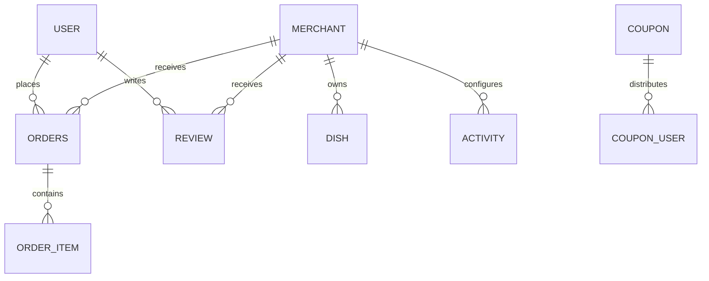

# 管理端接口详细设计

## 1. 文档说明

本文档基于当前项目源码整理，目标是从以下 3 个维度说明管理端实现：

- 接口设计：接口分组、路径、鉴权方式、入参模型、返回模型、关键业务规则
- 实体设计：管理端涉及的核心实体、关键字段、状态语义、实体关系
- Service 设计：后台治理逻辑的职责边界、主要方法、聚合查询和事务处理方式

本文档的“管理端”主要指 `/api/admin/**` 下的后台接口，覆盖：

- 平台总览
- 用户治理
- 商家审核与上下线
- 全平台订单监控
- 优惠券管理
- 活动管理
- 评价治理

说明：

- 管理员登录后也可以使用 `/api/chat/*` 获取平台运营助手能力，但该接口不属于 `/api/admin/**`，因此本文档只在扩展说明中提及，不作为核心管理接口展开。

## 2. 源码范围

### 2.1 Controller

- `src/main/java/org/example/ordermanagement/controller/admin/AdminDashboardController.java`
- `src/main/java/org/example/ordermanagement/controller/admin/AdminMerchantController.java`
- `src/main/java/org/example/ordermanagement/controller/admin/AdminOrderController.java`
- `src/main/java/org/example/ordermanagement/controller/admin/AdminUserController.java`
- `src/main/java/org/example/ordermanagement/controller/admin/AdminCouponController.java`
- `src/main/java/org/example/ordermanagement/controller/admin/AdminActivityController.java`
- `src/main/java/org/example/ordermanagement/controller/admin/AdminReviewController.java`

### 2.2 Service / 业务实现

- `src/main/java/org/example/ordermanagement/service/impl/MerchantServiceImpl.java`
- `src/main/java/org/example/ordermanagement/service/impl/OrderServiceImpl.java`
- `src/main/java/org/example/ordermanagement/service/impl/CouponServiceImpl.java`
- `src/main/java/org/example/ordermanagement/service/impl/ActivityServiceImpl.java`
- `src/main/java/org/example/ordermanagement/service/impl/ReviewServiceImpl.java`
- `src/main/java/org/example/ordermanagement/service/impl/BusinessContextServiceImpl.java`

说明：

- 管理端中“用户治理”是一个例外，当前没有单独的 `AdminUserService`，而是在 `AdminUserController` 中直接操作 `UserMapper`。

### 2.3 DTO / VO

- `src/main/java/org/example/ordermanagement/dto/UserQueryDTO.java`
- `src/main/java/org/example/ordermanagement/dto/MerchantQueryDTO.java`
- `src/main/java/org/example/ordermanagement/dto/MerchantAuditDTO.java`
- `src/main/java/org/example/ordermanagement/dto/MerchantStatusDTO.java`
- `src/main/java/org/example/ordermanagement/dto/AdminOrderQueryDTO.java`
- `src/main/java/org/example/ordermanagement/dto/AdminCouponQueryDTO.java`
- `src/main/java/org/example/ordermanagement/dto/CouponSaveDTO.java`
- `src/main/java/org/example/ordermanagement/dto/AdminActivityQueryDTO.java`
- `src/main/java/org/example/ordermanagement/dto/ActivitySaveDTO.java`
- `src/main/java/org/example/ordermanagement/dto/AdminReviewQueryDTO.java`
- `src/main/java/org/example/ordermanagement/vo/AdminDashboardVO.java`
- `src/main/java/org/example/ordermanagement/vo/AdminOrderVO.java`
- `src/main/java/org/example/ordermanagement/vo/AdminOrderDetailVO.java`
- `src/main/java/org/example/ordermanagement/vo/ActivityVO.java`
- `src/main/java/org/example/ordermanagement/vo/ReviewVO.java`

### 2.4 实体

- `src/main/java/org/example/ordermanagement/entity/User.java`
- `src/main/java/org/example/ordermanagement/entity/Merchant.java`
- `src/main/java/org/example/ordermanagement/entity/Dish.java`
- `src/main/java/org/example/ordermanagement/entity/Orders.java`
- `src/main/java/org/example/ordermanagement/entity/OrderItem.java`
- `src/main/java/org/example/ordermanagement/entity/Coupon.java`
- `src/main/java/org/example/ordermanagement/entity/CouponUser.java`
- `src/main/java/org/example/ordermanagement/entity/Activity.java`
- `src/main/java/org/example/ordermanagement/entity/Review.java`

## 3. 通用设计约定

## 3.1 鉴权设计

管理端统一由 Spring Security 控制：

- `/api/admin/**` 仅允许 `ROLE_ADMIN` 访问
- 非管理员访问管理端接口时会被 Security 层直接拦截

这意味着管理端接口本身几乎不再做二次角色判断，默认认为进入 Controller 的请求已经是管理员请求。

相关源码：

- `src/main/java/org/example/ordermanagement/security/SecurityConfig.java`

## 3.2 统一返回结构

管理端与其他端共用 `Result<T>` 响应包装：

```json
{
  "code": 200,
  "message": "success",
  "data": {}
}
```

说明：

- `code = 200` 表示业务成功
- `code = 500` 表示业务失败
- 业务异常统一抛 `BusinessException`
- 参数异常和运行时异常由全局异常处理器接管

相关源码：

- `src/main/java/org/example/ordermanagement/common/result/Result.java`
- `src/main/java/org/example/ordermanagement/config/GlobalExceptionHandler.java`

## 3.3 管理端风格

当前管理端实现风格不是完全统一的，主要分为两类：

- 业务域复用型
  - 订单、商家、活动、优惠券、评价
  - 主要通过 Service 实现
- 直接数据治理型
  - 用户管理
  - 当前在 Controller 内直接调用 Mapper

这说明项目目前后台层更偏“功能够用优先”，而不是严格的后台分层统一。

## 4. 管理端接口模块设计

## 4.1 平台总览 Dashboard

Controller：`AdminDashboardController`

| 接口 | 方法 | 鉴权 | 入参 | 返回 | 说明 |
| --- | --- | --- | --- | --- | --- |
| `/api/admin/dashboard` | `GET` | 管理员 | 无 | `Result<AdminDashboardVO>` | 平台核心总览指标 |

### 4.1.1 出参模型

- `AdminDashboardVO`
  - `userCount`
  - `merchantCount`
  - `dishCount`
  - `orderCount`
  - `paidOrderCount`
  - `totalSalesAmount`

### 4.1.2 指标口径

- `userCount`：用户总数
- `merchantCount`：商家总数
- `dishCount`：菜品总数
- `orderCount`：订单总数
- `paidOrderCount`：状态为以下之一的订单数
  - `PAID`
  - `ACCEPTED`
  - `COMPLETED`
  - `RECEIVED`
  - `REFUNDED`
- `totalSalesAmount`：上述“已支付口径订单”的 `totalAmount` 汇总

### 4.1.3 Service 设计

该接口复用 `OrderServiceImpl.getAdminDashboard()`。

特点：

- 没有独立 DashboardService
- 统计逻辑集中在订单服务中
- 对“营收”的定义偏平台 GMV 口径，而不是净收入、抽佣收入或已结算收入

## 4.2 用户治理

Controller：`AdminUserController`

| 接口 | 方法 | 鉴权 | 入参 | 返回 | 说明 |
| --- | --- | --- | --- | --- | --- |
| `/api/admin/users/page` | `GET` | 管理员 | `UserQueryDTO` | `Result<IPage<User>>` | 分页查询用户 |
| `/api/admin/users/{id}/status` | `POST` | 管理员 | 路径变量 + `status` 请求参数 | `Result<String>` | 启用 / 禁用用户 |

### 4.2.1 入参模型

- `UserQueryDTO`
  - `username`
  - `phone`
  - `status`
  - `current`
  - `size`

说明：

- 当前代码注释写的是 `null=全部 0=正常 1=禁用`
- 但实际实现中 `status = 1` 表示正常，`status = 0` 表示禁用
- 这个注释与代码语义不一致，需要注意

### 4.2.2 查询规则

- 可按用户名模糊搜索
- 可按手机号模糊搜索
- 可按状态筛选
- 永远排除 `ADMIN` 角色账号，避免后台误操作管理员
- 返回前会手动将 `password` 置空

### 4.2.3 状态更新规则

- 仅允许 `status = 0` 或 `status = 1`
- 禁止操作管理员账号
- `0` 表示禁用
- `1` 表示恢复正常

### 4.2.4 实现特点

这是当前管理端最特别的一块：

- 没有 `AdminUserService`
- Controller 中直接使用 `UserMapper`
- 查询条件、数据脱敏、状态校验都直接写在 Controller

优点：

- 实现简单直接

缺点：

- 不利于后续扩展更复杂的用户治理规则
- Controller 职责偏重

## 4.3 商家治理

Controller：`AdminMerchantController`

| 接口 | 方法 | 鉴权 | 入参 | 返回 | 说明 |
| --- | --- | --- | --- | --- | --- |
| `/api/admin/merchant/page` | `GET` | 管理员 | `MerchantQueryDTO` | `Result<IPage<Merchant>>` | 商家分页查询 |
| `/api/admin/merchant/audit` | `POST` | 管理员 | `MerchantAuditDTO` | `Result<String>` | 审核入驻商家 |
| `/api/admin/merchant/status` | `POST` | 管理员 | `MerchantStatusDTO` | `Result<String>` | 更新商家状态 |

### 4.3.1 入参模型

- `MerchantQueryDTO`
  - `shopName`
  - `status`
  - `current`
  - `size`
- `MerchantAuditDTO`
  - `id`
  - `status`
- `MerchantStatusDTO`
  - `id`
  - `status`

### 4.3.2 商家状态设计

从现有代码可推断状态语义如下：

- `0`：待审核
- `1`：审核通过 / 正常
- `2`：下线 / 停用 / 封禁
- `3`：审核拒绝

### 4.3.3 审核规则

- `auditMerchant()` 仅允许将状态设置为：
  - `1`：审核通过
  - `3`：审核拒绝
- 适用于新商家入驻审核

### 4.3.4 状态更新规则

- `updateMerchantStatus()` 仅允许：
  - `1`：恢复正常
  - `2`：强制下线 / 停用

### 4.3.5 Service 设计

对应服务：`MerchantServiceImpl`

管理端相关核心方法：

- `pageMerchants(MerchantQueryDTO queryDTO)`
- `auditMerchant(MerchantAuditDTO dto)`
- `updateMerchantStatus(MerchantStatusDTO dto)`

实现特点：

- 当前后台商家分页直接返回 `Merchant` 实体
- 未单独设计管理端商家 VO
- 这会把 `userId`、`businessLicense` 等字段一并返回给后台前端

## 4.4 全平台订单监控

Controller：`AdminOrderController`

| 接口 | 方法 | 鉴权 | 入参 | 返回 | 说明 |
| --- | --- | --- | --- | --- | --- |
| `/api/admin/order/page` | `GET` | 管理员 | `AdminOrderQueryDTO` | `Result<IPage<AdminOrderVO>>` | 全平台订单分页 |
| `/api/admin/order/{id}` | `GET` | 管理员 | 路径变量 | `Result<AdminOrderDetailVO>` | 查看单笔订单详情 |

### 4.4.1 入参模型

- `AdminOrderQueryDTO`
  - `orderNo`
  - `status`
  - `current`
  - `size`

说明：

- Controller 注释写的是“可按店铺、用户、状态等维度检索”
- 但当前真实实现只支持：
  - `orderNo`
  - `status`

### 4.4.2 出参模型

- `AdminOrderVO`
  - `id`
  - `orderNo`
  - `username`
  - `shopName`
  - `totalAmount`
  - `status`
  - `remark`
  - `createTime`
- `AdminOrderDetailVO`
  - `id`
  - `orderNo`
  - `username`
  - `shopName`
  - `totalAmount`
  - `status`
  - `remark`
  - `contactName`
  - `contactPhone`
  - `deliveryAddress`
  - `createTime`
  - `items`

### 4.4.3 Service 设计

对应服务：`OrderServiceImpl`

管理端相关核心方法：

- `pageAdminOrders(AdminOrderQueryDTO dto)`
- `getAdminOrderDetail(Long orderId)`
- `getAdminDashboard()`

### 4.4.4 设计特点

- 订单分页查的是 `Orders` 主表
- 订单列表页额外关联 `User` 和 `Merchant`
- 订单详情页额外关联 `OrderItem`
- 当前管理端订单能力是纯查询，不支持管理员直接改单、退款或结算

## 4.5 优惠券管理

Controller：`AdminCouponController`

| 接口 | 方法 | 鉴权 | 入参 | 返回 | 说明 |
| --- | --- | --- | --- | --- | --- |
| `/api/admin/coupon` | `POST` | 管理员 | `CouponSaveDTO` | `Result<Void>` | 创建优惠券模板 |
| `/api/admin/coupon/{id}` | `PUT` | 管理员 | 路径变量 + `CouponSaveDTO` | `Result<Void>` | 更新优惠券模板 |
| `/api/admin/coupon/{id}` | `DELETE` | 管理员 | 路径变量 | `Result<Void>` | 删除优惠券模板 |
| `/api/admin/coupon/page` | `GET` | 管理员 | `AdminCouponQueryDTO` | `Result<IPage<Coupon>>` | 优惠券模板分页 |

### 4.5.1 入参模型

- `CouponSaveDTO`
  - `name`
  - `type`
  - `value`
  - `minAmount`
  - `startTime`
  - `endTime`
  - `totalCount`
  - `eachLimit`
- `AdminCouponQueryDTO`
  - `name`
  - `type`
  - `current`
  - `size`

### 4.5.2 业务规则

- 创建时自动：
  - `remainCount = totalCount`
  - `status = ACTIVE`
  - `eachLimit` 为空则默认 `1`
- 更新时允许直接改模板信息
- 更新总量时，会通过差值同步调整 `remainCount`
- 删除时会先删 `coupon_user` 中已发放记录，再删 `coupon` 主记录

### 4.5.3 Service 设计

对应服务：`CouponServiceImpl`

管理端相关核心方法：

- `createCoupon(CouponSaveDTO dto)`
- `updateCoupon(Long id, CouponSaveDTO dto)`
- `deleteCoupon(Long id)`
- `pageAdminCoupons(AdminCouponQueryDTO dto)`

### 4.5.4 设计特点

- 后台分页直接返回 `Coupon` 实体，而不是后台专用 VO
- 当前删除是物理删除，不是逻辑下架
- 一旦删除，会同步删除用户领券记录

## 4.6 活动管理

Controller：`AdminActivityController`

| 接口 | 方法 | 鉴权 | 入参 | 返回 | 说明 |
| --- | --- | --- | --- | --- | --- |
| `/api/admin/activity` | `POST` | 管理员 | `ActivitySaveDTO` | `Result<Void>` | 创建活动 |
| `/api/admin/activity/{id}` | `PUT` | 管理员 | 路径变量 + `ActivitySaveDTO` | `Result<Void>` | 更新活动 |
| `/api/admin/activity/{id}` | `DELETE` | 管理员 | 路径变量 | `Result<Void>` | 删除活动 |
| `/api/admin/activity/page` | `GET` | 管理员 | `AdminActivityQueryDTO` | `Result<IPage<ActivityVO>>` | 活动分页 |

### 4.6.1 入参模型

- `ActivitySaveDTO`
  - `name`
  - `description`
  - `rules`
  - `startTime`
  - `endTime`
  - `merchantId`
- `AdminActivityQueryDTO`
  - `name`
  - `current`
  - `size`

### 4.6.2 活动规则设计

- `rules` 使用 JSON 字符串存储
- 典型结构：

```json
[
  { "threshold": 30, "reduce": 5 },
  { "threshold": 50, "reduce": 10 }
]
```

### 4.6.3 出参模型

- `ActivityVO`
  - `id`
  - `name`
  - `description`
  - `rules`
  - `startTime`
  - `endTime`
  - `merchantId`
  - `merchantName`
  - `status`

### 4.6.4 Service 设计

对应服务：`ActivityServiceImpl`

管理端相关核心方法：

- `createActivity(ActivitySaveDTO dto)`
- `updateActivity(Long id, ActivitySaveDTO dto)`
- `deleteActivity(Long id)`
- `pageAdminActivities(AdminActivityQueryDTO dto)`

实现特点：

- 创建即生效，默认 `status = ACTIVE`
- 活动分页会补充 `merchantName`
- 既支持平台活动，也支持商家级活动

## 4.7 评价治理

Controller：`AdminReviewController`

| 接口 | 方法 | 鉴权 | 入参 | 返回 | 说明 |
| --- | --- | --- | --- | --- | --- |
| `/api/admin/review/page` | `GET` | 管理员 | `AdminReviewQueryDTO` | `Result<IPage<ReviewVO>>` | 评价分页 |
| `/api/admin/review/block/{reviewId}` | `POST` | 管理员 | 路径变量 + 请求体 `{status}` | `Result<String>` | 屏蔽 / 取消屏蔽评价 |

### 4.7.1 入参模型

- `AdminReviewQueryDTO`
  - `orderNo`
  - `shopName`
  - `current`
  - `size`

### 4.7.2 出参模型

- `ReviewVO`
  - `id`
  - `orderId`
  - `merchantId`
  - `shopName`
  - `nickname`
  - `avatar`
  - `rating`
  - `content`
  - `merchantReply`
  - `merchantReplyTime`
  - `followUpContent`
  - `followUpTime`
  - `status`
  - `createTime`

### 4.7.3 业务规则

- 后台分页支持按商家名筛
- 后台分页支持按订单号筛
- 屏蔽接口直接改 `Review.status`
  - `1`：正常
  - `0`：屏蔽

### 4.7.4 Service 设计

对应服务：`ReviewServiceImpl`

管理端相关核心方法：

- `pageAdminReviews(AdminReviewQueryDTO dto)`
- `blockReview(Long reviewId, Integer status)`

实现特点：

- 会先根据商家名查询 `merchantId`
- 会先根据订单号查询 `orderId`
- 最终再去分页查 `Review`
- 返回时会补全用户昵称、头像和商家名

## 5. 管理端涉及的实体设计

## 5.1 核心实体

| 实体 | 管理端用途 | 关键字段 |
| --- | --- | --- |
| `User` | 用户治理、账号启停 | `username`、`phone`、`role`、`status` |
| `Merchant` | 入驻审核、封禁下线 | `shopName`、`businessLicense`、`status`、`isOpen` |
| `Dish` | Dashboard 菜品统计 | `merchantId`、`status`、`stock`、`sales` |
| `Orders` | 平台订单分页、订单监控、Dashboard 汇总 | `orderNo`、`userId`、`merchantId`、`totalAmount`、`status` |
| `OrderItem` | 平台订单详情 | `orderId`、`dishName`、`price`、`quantity` |
| `Coupon` | 优惠券模板管理 | `type`、`value`、`remainCount`、`eachLimit`、`status` |
| `CouponUser` | 删除优惠券时联动清理用户领券记录 | `userId`、`couponId`、`status`、`orderId` |
| `Activity` | 活动模板配置 | `name`、`rules`、`merchantId`、`status` |
| `Review` | 内容治理、评论屏蔽 | `orderId`、`merchantId`、`rating`、`content`、`status` |

## 5.2 核心关系



## 5.3 关键状态字段

### 5.3.1 用户

- `User.role`
  - `USER`
  - `MERCHANT`
  - `ADMIN`
- `User.status`
  - `1`：正常
  - `0`：禁用

### 5.3.2 商家

- `Merchant.status`
  - `0`：待审核
  - `1`：审核通过
  - `2`：下线 / 停用
  - `3`：审核拒绝
- `Merchant.isOpen`
  - `1`：营业中
  - `0`：打烊

### 5.3.3 订单

- `PENDING_PAYMENT`
- `PAID`
- `ACCEPTED`
- `COMPLETED`
- `CANCELLED`
- `RECEIVED`
- `REFUND_PENDING`
- `REFUNDED`

### 5.3.4 优惠券

- `Coupon.status`
  - `ACTIVE`
  - `INACTIVE`
- `CouponUser.status`
  - `UNUSED`
  - `USED`
  - `EXPIRED`

### 5.3.5 活动

- `Activity.status`
  - `ACTIVE`
  - `INACTIVE`

### 5.3.6 评价

- `Review.status`
  - `1`：正常
  - `0`：屏蔽

## 6. Service 层职责分析

| 模块 | 主要实现 | 职责 | 备注 |
| --- | --- | --- | --- |
| 平台总览 | `OrderServiceImpl` | 统计平台用户、商家、菜品、订单和营收 | 没有独立 DashboardService |
| 用户治理 | `AdminUserController + UserMapper` | 分页查用户、启停用用户 | 当前未抽 Service |
| 商家治理 | `MerchantServiceImpl` | 商家分页、审核、状态更新 | 管理端与商家端共用一个服务 |
| 订单监控 | `OrderServiceImpl` | 全平台订单分页、订单详情 | 管理端只读 |
| 优惠券管理 | `CouponServiceImpl` | 券模板 CRUD、分页 | 管理端与用户端领券逻辑共用 |
| 活动管理 | `ActivityServiceImpl` | 活动 CRUD、分页、规则存储 | 管理端与用户端活动计算共用 |
| 评价治理 | `ReviewServiceImpl` | 评论分页、屏蔽 / 解除屏蔽 | 管理端与商家回复、用户评价共用 |

## 7. 典型管理流程

## 7.1 商家入驻审核流

1. 商家提交入驻资料，生成 `Merchant(status=0)`
2. 管理员查看 `/api/admin/merchant/page`
3. 管理员调用 `/api/admin/merchant/audit`
4. 后端把状态更新为：
   - `1` 审核通过
   - `3` 审核拒绝

## 7.2 平台封店流

1. 管理员查询商家
2. 调用 `/api/admin/merchant/status`
3. 后端把商家状态改为：
   - `2` 下线 / 封禁
   - `1` 恢复正常

说明：

- 管理端封店改的是 `status`
- 商家自助营业开关改的是 `isOpen`
- 两者语义不同

## 7.3 用户封禁流

1. 管理员分页查询用户
2. 选择用户调用 `/api/admin/users/{id}/status?status=0`
3. 用户状态改为禁用
4. 被禁用用户下次请求时会在 JWT 过滤阶段被拒绝访问

## 7.4 营销配置流

### 优惠券

1. 管理员创建优惠券模板
2. 模板状态默认为 `ACTIVE`
3. 用户端领取时基于该模板派生 `CouponUser`

### 活动

1. 管理员创建活动
2. 活动规则写入 `rules` JSON
3. 用户下单或活动预估时由 `ActivityServiceImpl.calculateDiscount(...)` 动态解析

## 7.5 评价治理流

1. 管理员分页查询评价
2. 根据商家名或订单号筛选可疑评价
3. 调用屏蔽接口修改 `Review.status`
4. 用户端和商家端查询评价时只展示 `status = 1` 的记录

## 7.6 运营看板流

1. 管理员进入后台首页
2. 前端调用 `/api/admin/dashboard`
3. 后端聚合多表统计
4. 返回 Dashboard 指标

## 8. 管理端扩展能力

虽然不属于 `/api/admin/**`，但管理员登录后使用 `/api/chat/*` 时，系统会走管理员专属上下文：

- 平台全局数据概览
- 最近全平台订单摘要

对应实现：

- `BusinessContextServiceImpl.buildAdminContext()`

这使得管理端具备一定的“运营助手”能力，可用于自然语言查看平台数据。

## 9. 当前实现的优点

- 管理端模块划分明确，围绕治理对象展开
- 权限边界清楚，所有 `/api/admin/**` 统一由 `ADMIN` 角色控制
- 多数管理能力复用了业务域 Service，避免规则分叉
- Dashboard、订单详情、评价列表都做了面向管理场景的聚合输出
- 商家状态治理区分了“审核状态 / 平台封禁”和“商家营业开关”
- 营销、评价、订单都能与前台业务形成闭环

## 10. 当前实现需要关注的点

- `UserQueryDTO` 中关于状态的注释与真实代码语义不一致，容易误导前端联调
- `AdminOrderController` 注释声称支持按用户、店铺等筛选，但当前实现实际只支持订单号和状态
- 后台返回模型不完全统一，部分接口回实体，部分接口回 VO
- `AdminUserController` 直接操作 `UserMapper`，分层风格与其他后台模块不一致
- 当前缺少后台操作日志、审计记录、审批备注等治理型系统常见能力
- 商家审核接口只改状态，不保存驳回原因
- 优惠券和活动删除当前是直接删除，未设计“下架但保留历史”能力
- 后台大多为单条操作，尚未提供批量审核、批量封禁、批量下架等能力

## 11. 小结

从当前实现看，管理端已经具备一个中小型平台后台的核心骨架：

- 可以看平台总览
- 可以管理用户
- 可以审核和下线商家
- 可以监控全平台订单
- 可以维护营销工具
- 可以治理评价内容

整体设计风格偏“业务域复用 + 后台轻包装”，不是一个特别重的中台式后台，但对课程项目、毕业设计或早期平台原型来说已经足够完整。后续如果继续演进，最值得优先优化的是：

- 管理端返回模型统一 VO 化
- 用户治理下沉到 Service
- 增加审计日志和操作记录
- 补齐后台筛选条件和批量操作能力
