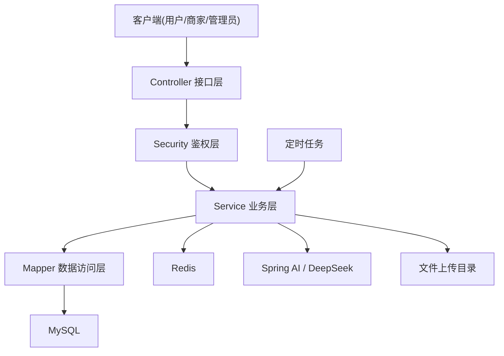

# OrderManagement 项目报告完整版

## 1. 项目概述

### 1.1 项目名称

OrderManagement 外卖订单管理系统后端

### 1.2 报告说明

本报告基于当前仓库截至 2026 年 3 月 27 日的源码、配置文件与现有文档整理而成，重点从项目背景、目标、技术架构、功能实现、核心流程、工程质量、风险与优化方向等方面，对项目进行完整总结。

本报告覆盖的是后端仓库本身，不包含独立前端工程源码。如需配合答辩展示，可将本报告作为“项目总报告”或“毕业设计项目说明书”的主体内容。

### 1.3 项目定位

该项目是一个面向外卖/点餐业务场景的综合性后台系统，围绕三类角色构建完整业务闭环：

| 角色 | 核心目标 | 主要能力 |
| --- | --- | --- |
| 用户端 | 完成浏览、下单、支付、售后与评价 | 注册登录、浏览商家、购物车、下单、优惠券、退款、评价、智能客服 |
| 商家端 | 完成店铺经营与订单处理 | 商家入驻、菜品管理、营业状态切换、接单、退款审核、经营统计 |
| 管理端 | 完成平台治理与运营管理 | 用户治理、商家审核、订单监控、优惠券管理、活动管理、评价治理、平台总览 |

### 1.4 项目目标

本项目旨在实现一个结构清晰、功能完整、具备一定工程实践深度的外卖订单管理系统后端，主要目标包括：

- 实现多角色统一鉴权和权限隔离
- 构建完整的订单生命周期管理能力
- 支持营销能力，如优惠券与满减活动
- 提供商家经营统计和平台总览数据
- 引入 Redis、JWT、定时任务、文件上传等常见后端能力
- 结合 Spring AI 实现具备业务上下文的智能客服功能

## 2. 项目背景与意义

随着线上点餐和即时零售业务的发展，外卖平台类系统已经成为典型的互联网业务模型。此类系统通常涉及用户、商家和平台管理员三方角色，既包含高频交易链路，也涉及权限控制、库存扣减、订单状态流转、售后处理和运营活动管理。

从课程设计、项目实训或毕业设计角度看，该类项目具有以下价值：

- 业务场景典型，便于体现完整的软件工程过程
- 涉及数据库建模、接口设计、权限控制和事务处理等核心能力
- 可覆盖 Redis、Docker、JWT、消息限流、定时任务等工程实践点
- 易于与 AI、推荐、数据分析等热点能力结合，提升项目创新度

本项目正是在上述背景下构建的一个较完整的后端系统实践案例。

## 3. 项目范围与仓库现状

### 3.1 当前仓库范围

当前仓库是基于 Maven 的 Spring Boot 后端工程，核心目录如下：

```text
OrderManagement
├─ src/main/java                核心业务代码
├─ src/main/resources           配置、Mapper XML、数据库脚本
├─ src/test/java                测试代码
├─ docs                         已有分析与接口设计文档
├─ uploads                      本地上传资源目录
├─ Dockerfile                   Docker 部署文件
└─ pom.xml                      Maven 依赖与构建配置
```

### 3.2 仓库规模概览

基于当前源码静态统计，仓库规模如下：

| 指标 | 数量 |
| --- | --- |
| Controller 数量 | 24 |
| Service 实现类数量 | 17 |
| Entity 数量 | 12 |
| Mapper 接口数量 | 12 |
| 主体 Java 文件数 | 152 |
| 主体 Java 代码行数 | 6400+ |
| 测试文件数 | 1 |

### 3.3 现有文档基础

仓库中已存在较详细的模块文档：

- 用户端接口详细设计
- 管理端接口详细设计
- `common` 与 `config` 包分析

因此，本报告不重复逐接口穷举，而是从项目全局视角进行系统性总结。

## 4. 技术选型与开发环境

### 4.1 核心技术栈

| 分类 | 技术 |
| --- | --- |
| 开发语言 | Java 17 |
| 核心框架 | Spring Boot 3.2.5 |
| Web 层 | Spring MVC、Spring Web |
| 安全认证 | Spring Security、JWT |
| 数据访问 | MyBatis-Plus |
| 数据库 | MySQL |
| 缓存/临时存储 | Redis |
| 参数校验 | Spring Validation |
| 响应式支持 | Spring WebFlux、Reactor |
| AI 能力 | Spring AI、DeepSeek(OpenAI 协议兼容接入) |
| 构建工具 | Maven |
| 容器化 | Docker |
| 辅助库 | Lombok、Jackson |

### 4.2 技术选型理由

| 技术 | 选择原因 |
| --- | --- |
| Spring Boot | 生态成熟，适合快速搭建企业级后端服务 |
| Spring Security + JWT | 便于实现无状态鉴权和多角色权限隔离 |
| MyBatis-Plus | 简化单表 CRUD 与分页查询开发，提高编码效率 |
| Redis | 适合存放验证码、聊天上下文、访问计数等临时数据 |
| Spring AI | 抽象了大模型调用接口，便于后续替换模型供应商 |
| Docker | 方便部署、演示和环境统一 |

## 5. 系统总体架构设计

### 5.1 分层架构

项目整体采用典型的分层式后端架构：

- Controller 层：负责接口暴露、请求参数接收和响应返回
- DTO/VO 层：分别承担请求入参与视图出参建模
- Service 层：负责核心业务规则、状态流转和事务处理
- Mapper 层：负责数据库访问与 SQL 映射
- Entity 层：负责数据库实体建模
- Config/Common/Security 层：负责系统运行支撑能力

### 5.2 架构示意图



### 5.3 主要包结构说明

| 包路径 | 作用 |
| --- | --- |
| `controller.user` | 用户端接口 |
| `controller.merchant` | 商家端接口 |
| `controller.admin` | 管理端接口 |
| `controller.common` | 登录、上传、智能客服等公共接口 |
| `service.impl` | 业务实现类 |
| `security` | JWT、用户认证、权限配置 |
| `config` | 全局配置、异常处理、Redis、AI、MyBatis-Plus |
| `common` | 公共异常、统一返回、公共辅助逻辑 |

## 6. 核心功能模块设计

### 6.1 认证与权限控制模块

系统采用 Spring Security + JWT 的无状态认证方案：

- `/api/auth/**` 放行，用于登录、注册、验证码发送、游客令牌
- `/api/admin/**` 仅允许管理员访问
- `/api/merchant/**` 允许已登录用户进入，由业务层进一步校验是否为店铺所有者
- `/api/user/**`、`/api/order/**`、`/api/cart/**` 等用户侧接口要求登录
- `/api/chat/**` 在 Security 层放行，在 Controller 层二次判定游客与登录用户

认证流程如下：

1. 用户注册或登录
2. 后端生成带有角色信息的 JWT
3. 前端后续请求携带 `Authorization: Bearer <token>`
4. JWT 过滤器解析 Token，并将角色信息写入 SecurityContext
5. Security 配置和业务逻辑共同完成鉴权

该设计的优点是结构清晰、扩展性较好、适合多端统一接入。

### 6.2 用户端模块

用户端是项目中最完整的一部分，主要覆盖以下能力：

| 功能 | 说明 |
| --- | --- |
| 注册与登录 | 支持用户名/手机号登录，支持短信验证码注册与找回密码 |
| 用户信息维护 | 支持昵称、头像、邮箱、手机号、密码修改 |
| 地址管理 | 支持地址新增、修改、删除、查询 |
| 商家浏览 | 支持商家列表、店铺详情、菜品列表、评价浏览 |
| 购物车 | 支持加购、数量修改、删除、清空 |
| 订单系统 | 支持下单、支付、取消、查看详情、确认收货 |
| 营销能力 | 支持优惠券领取、优惠券查看、活动折扣参与 |
| 售后评价 | 支持退款申请、订单评价、追评 |
| 智能客服 | 支持基于上下文的问答与历史记录保存 |

用户端体现了“从浏览到下单再到售后”的完整链路，是项目业务深度的核心体现。

### 6.3 商家端模块

商家端围绕“开店与经营”展开，主要包括：

| 功能 | 说明 |
| --- | --- |
| 商家入驻申请 | 普通用户可提交入驻申请 |
| 店铺信息维护 | 支持查看自己的店铺、修改店铺信息 |
| 营业状态控制 | 支持营业/打烊切换 |
| 菜品分类管理 | 支持菜品分类维护 |
| 菜品管理 | 支持新增、编辑、上下架、分页查询 |
| 订单工作台 | 支持查看订单、接单、完成订单 |
| 售后处理 | 支持同意退款、拒绝退款 |
| 评价互动 | 支持商家回复用户评价 |
| 经营统计 | 提供近 7 日销售趋势、热销菜品、转化率等 |

商家端业务已经不局限于基础 CRUD，而是具有明显的经营视角和流程控制能力。

### 6.4 管理端模块

管理端主要承担平台治理和运营管理职责：

| 功能 | 说明 |
| --- | --- |
| 平台总览 | 用户数、商家数、菜品数、订单数、累计营收统计 |
| 用户治理 | 分页查看用户、禁用/启用用户 |
| 商家治理 | 商家审核、店铺状态管理 |
| 订单监控 | 平台范围订单查询、订单详情查看 |
| 优惠券管理 | 创建、修改、删除、分页查询 |
| 活动管理 | 创建、修改、删除平台/商家活动 |
| 评价治理 | 查看评价、屏蔽或恢复评价 |

管理端说明项目具备平台化思维，而不仅是单店点餐系统。

### 6.5 公共能力模块

除三端业务外，项目还实现了若干通用基础能力：

- 文件上传：头像、店铺图片、菜品图片上传
- 统一异常处理：`BusinessException` 与全局异常拦截
- 统一响应结构：`Result<T>`
- Redis 序列化配置
- MyBatis-Plus 分页拦截配置
- 智能客服统一入口

## 7. 关键业务流程分析

### 7.1 用户下单流程

用户下单是系统中最关键的交易流程，主要步骤如下：

1. 用户浏览店铺与菜品
2. 选择菜品加入购物车
3. 提交订单时选择地址、优惠券、备注
4. 后端校验用户、店铺状态、营业状态、菜品状态、库存与地址归属
5. 计算订单原价、活动优惠和优惠券优惠
6. 生成订单主表与订单明细
7. 扣减菜品库存并增加销量
8. 清空当前商家的购物车记录
9. 若使用优惠券，则将优惠券标记为已使用

该流程在 `OrderServiceImpl` 中通过事务实现，能较好保证订单、库存、购物车、优惠券之间的数据一致性。

### 7.2 订单生命周期

订单状态大致包括：

`PENDING_PAYMENT -> PAID -> ACCEPTED -> COMPLETED`

在此基础上，还扩展了：

- `CANCELLED`：待支付订单取消或超时取消
- `RECEIVED`：用户确认收货
- `REFUND_PENDING`：用户申请退款
- `REFUNDED`：商家同意退款

订单生命周期体现出较完整的交易流转和售后处理能力。

### 7.3 营销优惠流程

项目支持两类营销能力：

| 类型 | 说明 |
| --- | --- |
| 优惠券 | 支持平台发券、用户领取、限领数量控制、下单抵扣 |
| 满减活动 | 支持平台或商家维度活动，按 JSON 规则计算阶梯优惠 |

下单时系统会分别计算活动优惠和优惠券优惠，并取较优方案，体现了一定的业务复杂度。

### 7.4 售后与评价流程

在订单完成后，用户可以评价订单；在特定状态下，用户还可发起退款申请。商家收到退款申请后可以：

- 同意退款，并回滚库存与优惠券状态
- 拒绝退款，并记录拒绝原因

评价完成后商家可回复，用户还可追评，管理员则可对评价进行治理。

### 7.5 智能客服流程

项目的 AI 模块并非简单聊天接口，而是结合真实业务上下文构建能力：

1. 用户发起聊天请求
2. 系统从 Security 上下文解析真实角色
3. 根据角色生成不同 System Prompt
4. 预先注入最近订单、优惠券、经营统计或平台总览数据
5. 调用 Spring AI 封装的模型接口
6. 返回同步或流式回复
7. 将会话历史存入 Redis，并记录每日调用次数

这一设计是项目的创新亮点之一，体现了“业务系统 + 大模型”结合的思路。

## 8. 数据模型设计概述

### 8.1 主要实体

| 实体 | 作用 |
| --- | --- |
| `User` | 用户信息、角色、账号状态 |
| `Merchant` | 商家店铺信息、审核状态、营业状态 |
| `Dish` | 菜品信息、库存、价格、销量 |
| `DishCategory` | 菜品分类 |
| `Cart` | 用户购物车数据 |
| `Orders` | 订单主表 |
| `OrderItem` | 订单明细表 |
| `Address` | 用户收货地址 |
| `Coupon` | 优惠券主表 |
| `CouponUser` | 用户领取的优惠券 |
| `Activity` | 满减活动配置 |
| `Review` | 用户评价、商家回复与追评 |

### 8.2 核心关系

主要数据关系如下：

- 一个用户可以拥有多个地址
- 一个用户可以申请多个店铺
- 一个商家可以拥有多个菜品和多个订单
- 一个订单包含多个订单明细
- 一个用户可以领取多张优惠券
- 一个商家可以配置多个营销活动
- 一个订单最多对应一条评价

### 8.3 数据库变更

项目已引入部分数据库迁移脚本，用于补充字段和新增营销、退款能力，例如：

- 用户表昵称和头像字段
- 优惠券与活动表
- 订单原价、优惠金额字段
- 订单退款相关字段

这说明项目在迭代过程中有一定的演进意识。

## 9. 系统设计亮点

### 9.1 三端统一、逻辑清晰

项目将用户端、商家端、管理端放在一个后端工程中统一维护，但在接口路径、权限和业务职责上做了明确分层，既方便开发，也有利于答辩讲解。

### 9.2 事务控制较完整

订单创建、取消、退款等关键操作都通过事务包裹，避免了订单、库存、优惠券状态更新不一致的问题。

### 9.3 AI 客服与业务上下文结合

项目不是单纯接一个聊天接口，而是通过业务上下文服务动态注入订单、优惠券、商家经营和平台总览信息，增强了 AI 回复的业务相关性。

### 9.4 定时任务增强系统自动化

通过定时任务实现：

- 超时订单自动取消
- 过期优惠券自动失效
- 过期活动自动结束

这使系统具备了更接近真实业务系统的自动维护能力。

### 9.5 本地上传与静态资源映射

项目支持头像和业务图片上传，并将上传目录映射为静态资源访问路径，便于前后端联调。

### 9.6 容器化部署支持

通过多阶段 Dockerfile 可以直接构建和运行后端服务，为后续部署和答辩演示提供便利。

## 10. 工程质量与现状评估

### 10.1 优势

从源码情况看，项目具备以下明显优势：

- 功能链路完整，覆盖用户、商家、管理员三种角色
- 分层结构清晰，命名规范，便于维护
- 安全、缓存、文件上传、定时任务、AI 等能力齐全
- 文档基础较好，已有多份模块级说明文档
- 业务复杂度明显高于简单的增删改查项目

### 10.2 当前不足

尽管项目完成度较高，但从工程成熟度角度看，仍存在以下问题：

| 问题 | 说明 |
| --- | --- |
| 自动化测试薄弱 | 当前测试目录仅有一个基础启动测试，缺少业务测试和接口测试 |
| 敏感配置硬编码 | 数据库默认密码、JWT 密钥、AI Key 存在默认值配置 |
| 外部能力仍偏模拟 | 短信验证码仍通过控制台打印，未接真实短信网关 |
| 统计口径仍可优化 | 部分统计命名与实际计算逻辑不完全一致 |
| 并发能力未重点处理 | 库存扣减、优惠券领取等高并发场景暂无更强控制机制 |
| 可观测性不足 | 缺少监控、链路追踪、统一审计日志等能力 |

### 10.3 当前项目成熟度判断

综合判断，本项目属于：

“高完成度实战型课程/毕业设计后端项目”

它已经明显超过简单练习项目，但距离真正生产级系统仍有一段距离，主要差距体现在测试、配置治理、并发控制、外部集成和运维能力上。

## 11. 安全性与稳定性分析

### 11.1 已实现的安全措施

- 使用 BCrypt 对密码加密存储
- 使用 JWT 承载身份与角色信息
- 通过 Spring Security 实现路由级权限控制
- 对关键参数进行了 `@Valid` 校验
- 对业务异常和系统异常做了统一处理
- 对上传文件做了图片类型和大小限制

### 11.2 需要关注的风险

- 配置文件中存在默认密钥与默认数据库账号密码
- CORS 配置较宽松，适合开发阶段，不适合直接生产上线
- 缺少接口限流、防刷和更细粒度的审计能力
- AI 服务调用异常虽有兜底，但缺少更完善的熔断与监控机制

## 12. 测试、部署与运行方式

### 12.1 运行依赖

项目运行至少依赖以下服务：

- MySQL
- Redis
- Java 17 及以上
- Maven

若开启 AI 功能，还需要可用的大模型 API 配置。

### 12.2 配置方式

系统支持通过环境变量覆盖配置，例如：

- `SPRING_DATASOURCE_URL`
- `SPRING_DATASOURCE_USERNAME`
- `SPRING_DATASOURCE_PASSWORD`
- `SPRING_DATA_REDIS_HOST`
- `SPRING_DATA_REDIS_PORT`
- `UPLOAD_PATH`
- `DEEPSEEK_API_KEY`

### 12.3 Docker 部署

项目提供了多阶段 Dockerfile，流程如下：

1. 使用 Maven 镜像构建 JAR
2. 使用 JRE 镜像作为运行环境
3. 创建上传目录
4. 设置时区
5. 通过 `java -jar app.jar` 启动服务

该设计说明项目已经考虑到容器化交付。

### 12.4 测试现状

当前仓库仅保留一个基础启动测试，说明自动化测试体系尚未建立完成。后续若要提升项目质量，应重点补充：

- Service 层单元测试
- Controller 层接口测试
- 订单、退款、优惠券等关键流程的集成测试

## 13. 后续优化建议

为进一步提升项目质量和工程价值，可从以下方向继续完善：

### 13.1 工程化优化

- 将敏感配置彻底迁移到环境变量或配置中心
- 增加多环境配置，如开发、测试、生产环境分离
- 补齐单元测试、集成测试和接口自动化测试
- 引入统一日志规范和异常追踪

### 13.2 业务能力优化

- 接入真实支付流程，而不是当前的模拟支付
- 接入真实短信服务，提高验证码模块可用性
- 为订单增加配送状态、骑手信息等扩展能力
- 增加购物车失效策略、订单催单、消息通知等功能

### 13.3 性能与稳定性优化

- 为库存扣减、优惠券领取等场景引入乐观锁或分布式锁
- 优化统计查询，避免大表全量扫描
- 增加接口限流与防刷能力
- 引入消息队列处理异步通知与削峰逻辑

### 13.4 AI 能力优化

- 增加会话分类、用户意图识别与工单转人工
- 引入更规范的 Prompt 模板管理
- 增加 AI 回答审计和敏感回答拦截
- 将推荐、售后引导、运营分析等能力继续产品化

## 14. 项目总结

本项目围绕外卖平台这一典型互联网业务场景，较完整地实现了用户、商家、管理员三端统一协作的后台系统。系统不仅覆盖了注册登录、菜品管理、购物车、订单、售后、评价、营销活动等核心业务，还结合 JWT、Redis、定时任务、Docker 和 Spring AI 等技术，具备较强的综合实践价值。

从结果上看，该项目已经具备较强的课程展示能力和答辩表达价值，尤其适合突出以下几点：

- 多角色平台系统设计能力
- 订单交易链路与事务控制能力
- 营销系统与售后流程建模能力
- Spring Security + JWT 的权限设计能力
- Redis、定时任务、Docker 等工程能力
- 业务系统结合 AI 的创新能力

如果后续继续补齐测试、并发控制、配置治理和外部服务接入，该项目有潜力进一步提升为更接近生产级标准的综合性后端项目。

## 15. 附录：可用于答辩的简版结论

本项目是一个基于 Spring Boot 的外卖订单管理系统后端，面向用户、商家和管理员三类角色，完成了从注册登录、浏览点餐、订单交易、优惠活动、退款评价，到平台治理和经营分析的完整业务闭环。项目采用 Spring Security + JWT 实现权限控制，使用 MyBatis-Plus 访问 MySQL，通过 Redis 支撑验证码和 AI 会话上下文，并使用定时任务实现超时订单取消和营销资源自动失效。在此基础上，项目还接入了 Spring AI，对接 DeepSeek 实现具备业务上下文的智能客服能力。整体来看，项目结构完整、功能丰富、亮点明确，具备较强的实战展示价值。
